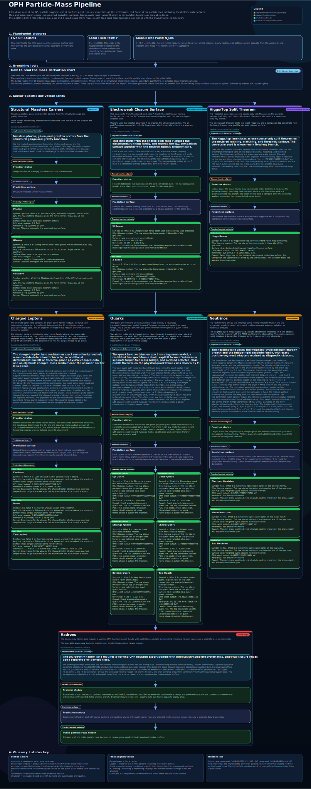

# Observer Patch Holography (OPH)

> Observer Patch Holography is the observer-consistency theory of everything. No observer sees the whole world at once; each observer gets a local patch; physics is the public fixed point that survives agreement across overlaps.

**French version:** [README_FR.md](README_FR.md)

**Quick links:** [OPH website](https://floatingpragma.io/oph/) | [OPH Textbooks](https://learn.floatingpragma.io/) | [Reverse Engineering Reality](https://oph-book.floatingpragma.io/) | [OPH Lab](https://oph-lab.floatingpragma.io) | [Applications](https://omega.floatingpragma.io/) | [OPH Blog](https://blog.floatingpragma.io/) | [Coherence map](https://coherence.floatingpragma.io/) | [Three-body demo](https://3body.floatingpragma.io/)

**Falsifiability:** [OPH falsifiability map](extra/OPH_falsifiability.md)
lists 40 hard OPH-killing outcomes and concrete IBM Quantum Cloud tests for
the reduced-sector hardware signature. Falsifiability is how a physics theory
pays rent. OPH is highly falsifiable: a massive graviton, a gauge-mediated
proton decay event, a fourth light matter generation, a charge-lattice outlier,
or neutrino data excluding the OPH branch would destroy OPH as stated.

If you want the existential answer first, jump straight to **Paper 6.
[Paradise as Fixed-Point Consensus](paper/paradise_as_fixed_point_consensus.pdf)**.
The short version is direct: yes, this universe is a simulation in the OPH
sense, an observer-based fixed-point consensus process. Yes, subjective
experience and minds are primary. Yes, space, time, and matter are
observer-facing appearances: stable effective structures generated by deeper
patch consistency. The illusion metaphor is handled below. The rest of this
README gives the mathematical proof stack and empirical verification surface.

OPH is the observer-first reconstruction of fundamental physics. It starts from
finite observers on finite holographic screen geometry. Its working basis is
quantum-algebraic: patch algebras, states, trace/Born event probabilities on
declared record surfaces, and generalized entropy are part of the formal
starting point. From that basis, OPH recovers the observed effective universe:
spacetime, gauge structure, particles, records, and observer synchronization all
follow from overlap consistency.

The operational claim is sharper than "information is fundamental." OPH models
reality as an observer-based fixed-point consensus process. Finite observer
patches carry local records, compare only what their overlaps expose, repair
mismatches through declared recovery moves, and settle into stable fixed points
that survive refinement. The public world is the overlap-stable output of that
process. This is the mathematical and empirical proof surface for OPH as the
correct theory of everything: the same observer-consistency architecture
recovers the established physics and explains why a world exists that can
produce observers capable of reconstructing it.

## Applications And OMEGA Hardware

OPH is also a hardware program. As the screen microphysics becomes explicit,
the same patch-consensus loop becomes an engineering handle on reality. A
bounded device exposes boundary data, compares records, repairs mismatch, and
locks onto stable states. OMEGA is the public hardware route into that loop:
physical chambers, labeled ports, control software, verifier receipts, and
repeatable records.

In plain language, OPH turns screen microphysics into a way to hack reality.
The goal is not metaphorical control of an abstract simulation. The goal is
physical control of small patches that can be driven, measured, repaired, and
verified.

The application thesis is simple. If reality is built from observer-patch
consistency, then useful machines can be built by driving small physical
patches into the right fixed points. That gives low-cost implementation tracks
for desktop fusion energy, room-temperature OMEGA supercomputing, OMEGA-based
AGI, and local gravity or inertia control for hoverbikes and hoverboards.

Read the public applications page at
[omega.floatingpragma.io](https://omega.floatingpragma.io/). Source notes for
the application tracks live in [`APPLICATIONS.md`](APPLICATIONS.md).

## The Spacetime Trap

The first conceptual hurdle is that OPH does not treat spacetime as the
container in which reality happens. Space and time are not things in themselves.
They are stable observer-facing descriptions that appear when many finite
perspectives can be made mutually consistent.

Some would call this an illusion. As a metaphor, that is fair: the container we
seem to inhabit is an appearance produced by deeper consistency. As physics,
the sharper phrase is emergent public description.

From inside one perspective, the world feels obvious. There is a roughly
spherical field of experience stretching outward, three directions to move in,
and time passing forward. Other observers report compatible contents from
different angles, so the natural guess is that everyone lives inside one
pre-existing spacetime filled with objects. OPH reverses that guess. Each
observer has a local spacetime description generated by its own accessible
records, clocks, horizons, and correlations. The public spacetime is the
compatibility layer that lets those descriptions agree.

This does not make ordinary spacetime arbitrary or useless. It explains why it
works so well. Einstein's equations describe the smooth large-scale grammar of
the shared appearance. The deeper claim is that the shared appearance is
emergent from observer overlap consistency, not part of the world's starting
inventory.

## What OPH Delivers

Most theories begin by assuming spacetime, quantum fields, and a list of
constants. OPH starts one step earlier than spacetime and quantum field theory,
with finite observers on finite quantum-algebraic holographic screen geometry
whose descriptions have to agree where their patches overlap. Push that
requirement hard enough and a 3+1-dimensional Lorentzian spacetime emerges,
together with a Jacobson-style Einstein equation and the realized Standard Model
quotient $SU(3)\times SU(2)\times U(1)/\mathbb Z_6$, including the exact
hypercharge lattice, the realized color triplet $N_c=3$, and the generation
count $N_g=3$. Quantum mechanics is the algebraic information language carried
by the OPH architecture.
On the declared support-visible compact-gauge branch, with four-dimensional
scaling, reflection positivity, repair completeness, and support-visible
continuum extraction in force, the same stack gives the Euclidean Yang-Mills
form and identifies the Yang-Mills mass gap with the repair gap. This is OPH's
four-dimensional axiomatic Yang-Mills construction on the declared branch.
Clay-facing admissibility is branch-dependent and turns on taking that
support-visible continuum extraction as the required four-dimensional
construction.

The mechanism is the fixed-point consensus loop. Local observers do not access
a global state from outside. They carry finite patch states, exchange
overlap-visible data, reject inconsistent continuations, and keep the stable
patterns that can be synchronized. Geometry, particles, laws, and records are
the large-scale fixed points of that observer-network computation.

## Geometry, Symmetry, and Simulators

Sphere language in OPH is geometry language. In symmetric regulator charts, an
observer-accessible cut can be represented by the two-sphere $S^2$. Those
charts describe angular support geometry. The finite simulator implements the
patch-and-overlap algebraic constraints exposed by that geometry.

That spherical chart carries several concrete jobs. Caps and collars give the
local cut data used by modular flow and entropy variation. The conformal group
of the sphere is the celestial-sphere form of the connected Lorentz group,
$\mathrm{SO}^+(3,1)$, so the same chart supplies the kinematic bridge to the
emergent $(3+1)$-dimensional spacetime branch. Spherical harmonics organize angular modes.
Finite cellulations of the same chart give the regulator surface on which patch
ports, edge data, and overlap checks can be made explicit.

The finite symmetry anchor is $A_5$, the rotational symmetry group of the
icosahedron. It supplies the icosahedral skeleton behind the echosahedral patch
carrier language: a finite, highly symmetric way to organize ports, overlaps,
and local comparison data without treating the carrier as a smooth ball.

The exceptional symmetry anchor is the $E_8$ Lie group and its root-lattice
structure. $E_8$ matters because it gives the exceptional closure language
used in the higher symmetry and representation side of the OPH stack. The
binary icosahedral group and affine $E_8$ meet through the McKay
correspondence. This is why $A_5$-icosahedral and $E_8$-type language can
belong to one symmetry story. These names mark symmetry constraints and
regulator structure.

The scale is set by two quantities: the total screen capacity read from the
de Sitter horizon and the local pixel ratio $P$, the area of one screen cell
in Planck-area units. For the observed cosmological constant, the bare horizon
area ratio is about $1.05\times10^{122}$, while the entropy capacity used by
OPH is about $3.31\times10^{122}$. From the outside, $P$ is a geometric
cell size slightly above the golden-ratio self-similar balance. From the
inside, it becomes the smallest electromagnetic observation scale available to
observers in the world encoded on that screen. The fine-structure lane asks for
the nonzero detuning of a holographic screen cell such that the cell's outer
geometric displacement equals the electromagnetic observation scale emitted by
the universe living on that same screen. The public solution is
$P\simeq1.6309682094$, with
$\alpha^{-1}(0)=137.035999177(21)$ and
$\alpha(0)\simeq0.00729735256433$. Hardware-facing checks of the
same fixed-point geometry are treated only as public evidence-bundle claims
when the raw artifacts and verifier receipts are available.

The same local pixel scale drives the gravity readout, the fine-structure
closure, gauge structure, scoped particle-mass rows, records, and observer
synchronization. The particle pipeline carries that scale into the weak sector,
the Higgs lane, selected-class quark rows, and the weighted-cycle neutrino
branch. Hadrons require either the OPH strong-binding backend or an explicitly
marked empirical hadron closure. The operating policy for those rows is in
[`HADRON.md`](HADRON.md).

### Selected Quantitative Rows

This table keeps the rows that are easiest to compare directly with PDG and
NIST values. Structural results such as the 3+1-dimensional Lorentzian spacetime, the
Standard Model quotient $SU(3)\times SU(2)\times U(1)/\mathbb Z_6$, the exact hypercharge
lattice, the realized color triplet $N_c=3$, and the generation count
$N_g=3$ live in the papers. The
quick view here sticks to direct numeric rows and exact zeros.

| Quantity | Symbol | OPH | PDG/NIST | Δ |
| --- | --- | --- | --- | --- |
| Gravitational constant | G | 6.6742999959e-11 | 6.67430(15)e-11 | 0.00003σ |
| Speed of light | c | 299792458 | 299792458 (exact) | match |
| Fine-structure (inv) | α⁻¹(0) | 137.035999177 | 137.035999177(21) | match |
| Photon mass | m_γ | 0 eV | <1e-18 eV | below bound |
| Gluon mass | m_g | 0 GeV | 0 GeV | match |
| Graviton mass | m_grav | 0 eV | <1.76e-23 eV | below bound |

**Quark sector**

| Quark | Symbol | OPH | PDG | Δ |
| --- | --- | --- | --- | --- |
| Bottom | m_b(m_b) | 4.183 GeV | 4.183 ± 0.007 | match |
| Charm | m_c(m_c) | 1.273 GeV | 1.2730 ± 0.0046 | match |
| Strange | m_s(2 GeV) | 93.5 MeV | 93.5 ± 0.8 | match |
| Down | m_d(2 GeV) | 4.70 MeV | 4.70 ± 0.07 | match |
| Up | m_u(2 GeV) | 2.16 MeV | 2.16 ± 0.07 | match |
| Top | m_t cross-section row | 172.35235532883115 GeV | 172.3523553288312 | selected-class match |

$\Delta$ reports the sigma distance where PDG or NIST quotes a one-standard-deviation
uncertainty. Otherwise it records "match" or "below bound".

For quarks, PDG uses its standard mass conventions: `u`, `d`, and `s` at
`2 GeV`, with `c` and `b` in the `MS` scheme at their own mass scale. The
papers also carry the structural Standard Model derivations listed above and a
neutrino family, but those do not collapse to one simple PDG or NIST row and
are left out of this table.

The particle surface also reports $W/Z$ values $80.377\,\mathrm{GeV}$ and
$91.18797809193725\,\mathrm{GeV}$, a Higgs value $m_H=125.1995304097179\,\mathrm{GeV}$, and a
selected-class top value $m_t=172.35235532883115\,\mathrm{GeV}$ using the PDG
cross-section top-mass convention. The weighted-cycle neutrino branch emits
$(0.017454720257976796, 0.019481987935919015, 0.05307522145074924)\,\mathrm{eV}$ on its
declared branch.

## Local Unification Surface

The local unification surface is organized around the public pixel ratio
$P\simeq1.6309682094$ and one local cell area. On that surface the same scale touches the
electroweak comparison lane, the Higgs lane, the gravity-side entropy relation,
and the familiar unit readout for meters, seconds, GeV, and Kelvin. The diagram
below shows how those pieces sit on one scale. The detailed formulas and claim
tiers live in the papers.

  

**OPH Stack**

  

The main OPH line from axioms to relativity, gauge structure, particles, and observers. Click to open the full SVG.

**Particle derivation stack**

  

A compact view of the particle lane. Click to open the full SVG.

## Papers

- **Paper 1. [Observers Are All You Need](paper/observers_are_all_you_need.pdf)**: broad synthesis of the OPH reconstruction program, from finite observers to the recovered effective universe.
- **Paper 2. [Recovering Relativity and the Standard Model from Observer Overlap Consistency](paper/recovering_relativity_and_standard_model_structure_from_observer_overlap_consistency_compact.pdf)**: compact technical core for relativity, gravity, realized Standard Model structure, and the support-visible compact-gauge Yang-Mills form/gap theorem under its declared branch assumptions.
- **Paper 3. [Deriving the Particle Zoo from Observer Consistency](paper/deriving_the_particle_zoo_from_observer_consistency.pdf)**: particle derivations, mass rows, coupling structure, and the quantitative comparison surface.
- **Paper 4. [Reality as a Consensus Protocol](paper/reality_as_consensus_protocol.pdf)**: fixed-point repair dynamics, record stability, and the consensus picture of public reality.
- **Paper 5. [Federated Echosahedral Screen Microphysics](paper/screen_microphysics_and_observer_synchronization.pdf)**: federated patch-carrier architecture, $A_5$-icosahedral and $E_8$-type symmetry framing, public hardware-evidence rules, records, recovery moves, and observer synchronization.
- **Paper 6. [Paradise as Fixed-Point Consensus](paper/paradise_as_fixed_point_consensus.pdf)**: final manifest paper for OPH's meaning layer: why anything exists, why this world is observer-compatible, the strange loop in which observers reverse engineer and build the continuation machinery, paradise on Earth or in engineered continuation environments, hell as enforced isolation or deprivation, resurrection as observer continuation, justice as continuation according to harm and repair records, and memetic evolution.
- **Calibration note. [Digital Calibration Note for OPH Screen Microphysics](paper/screen_microphysics_digital_calibration_note.pdf)**: the octahedral $\mathbb Z_2/S_3$ simulator suite, scoped as digital calibration for patch constraints and screen-geometry charts.

## Supplemental Papers

- **[Photonic Fixed-Point Consensus for SHA-256d Proof of Work](extra/Photonic_fixed-point_consensus_for_SHA-256d_proof_of_work.pdf)**: photonic candidate enrichment for SHA-256d proof of work.
- **[The Fine-Structure Constant as an OPH Pixel Fixed Point](extra/fine_structure_constant_derivation.pdf)**: fixed-point derivation of the fine-structure row.
- **[Explaining the Yang-Mills Mass Gap with Observer-Patch Repair Dynamics](extra/yang_mills_gap_clay_problem.pdf)**: support-visible OPH route to the Clay Yang-Mills problem, branch-scoped to the compact-gauge extraction, with Clay-facing status tied to that axiomatic-construction claim, and identifying the gap with the repair gap.
- **[Observer-Patch Holography and the Dark Matter Phenomenon](extra/oph_dark_matter_paper.pdf)**: dark-matter phenomenology and MOND-like galaxy limit.
- **[Thinking as Patch-Net Fixed-Point Search](extra/thinking_as_patch_net_fixed_point_search.pdf)**: cognition and qualia as recurrent patch consensus.

## More

- **Website:** [floatingpragma.io/oph](https://floatingpragma.io/oph)
- **Theory explainer:** [floatingpragma.io/oph/theory-of-everything](https://floatingpragma.io/oph/theory-of-everything)
- **Simulation-theory explainer:** [floatingpragma.io/oph/simulation-theory](https://floatingpragma.io/oph/simulation-theory/)
- **Coherence map:** [coherence.floatingpragma.io](https://coherence.floatingpragma.io): public graph surface for OPH concepts, overlaps, and cross-domain routes.
- **Applications:** [omega.floatingpragma.io](https://omega.floatingpragma.io): public applications page for OPH hardware, compute, energy, AGI, lift, and optical chamber consensus.
- **Three-body OPH demo:** [3body.floatingpragma.io](https://3body.floatingpragma.io): an extra simulator and proof walk-through for the OPH finite patch-net formulation of the three-body problem, framed as a loop-holonomy gluing example. No closed-form elementary solution is claimed.
- **Blog:** [blog.floatingpragma.io](https://blog.floatingpragma.io/) collects public OPH essays. Start with [Semiotics and the Physics of Meaning](https://blog.floatingpragma.io/semiotics-and-the-physics-of-meaning), [The Trigger](https://blog.floatingpragma.io/the-trigger), and [P = NP on the Observer Screen](https://blog.floatingpragma.io/p-equals-np-on-the-observer-screen). The computation essay treats `P = NP` as an observer-screen slogan, not a claim to solve the classical complexity problem.
- **Book:** [oph-book.floatingpragma.io](https://oph-book.floatingpragma.io)
- **Guided study app:** [learn.floatingpragma.io](https://learn.floatingpragma.io/)
- **Questions and detailed explanations:** OPH Sage on [Telegram](https://t.me/HoloObserverBot), [X](https://x.com/OphSage), or [Bluesky](https://bsky.app/profile/ophsage.bsky.social)
- **OPH Notebook:** [NotebookLM source notebook](https://notebooklm.google.com/notebook/d5249760-6ce8-44a0-927b-ccf90402711a) with explainer videos and additional study material.
- **Lab:** [oph-lab.floatingpragma.io](https://oph-lab.floatingpragma.io)
- **Common objections:** [extra/COMMON_OBJECTIONS.md](extra/COMMON_OBJECTIONS.md)
- **IBM Quantum note:** [extra/IBM_QUANTUM_CLOUD.md](extra/IBM_QUANTUM_CLOUD.md)

## Status Table

The fine-structure display row uses the fixed-point value
$\alpha^{-1}(0)=137.035999177(21)$ and
$P\simeq1.6309682094$. The source-side audit and endpoint residual records
live in the particle paper, where they are kept separate from the public
fixed-point row.

The weak-boson pair is a validation row. Charged-lepton absolute masses are
target-anchored witness rows. The auxiliary direct-top average is a validation
row. Hadron-controlled rows use the policy in [`HADRON.md`](HADRON.md):
source-only OPH values stay separate from OPH plus empirical hadron closure
values carried by the empirical $e^+e^-\to\mathrm{hadrons}$ payload class.

Strong CP is work in progress in the selected-class quark theorem:
the available corpus does not derive the QCD theta angle, does not emit the
physical strong-CP angle, and does not prove that the physical strong-CP phase
vanishes. The required bridge is the phase, anomaly, and topological-angle
descent on the realized branch.

## Repository Guide

- **[`paper/`](paper):** PDFs, LaTeX sources, and release metadata.
- **[`APPLICATIONS.md`](APPLICATIONS.md):** high-level application map for
  OPH energy, compute, AGI, and local-lift use cases.
- **[`book/`](book):** OPH Book source and generated downloadable PDF. Print-PDF build notes live in [`book/README.md`](book/README.md).
- **[`code/`](code):** computational material, particle outputs, and experiments.
- **[`HADRON.md`](HADRON.md):** policy for QCD-limited particle rows, empirical
  $e^+e^-\to\mathrm{hadrons}$ input, and fine-structure hadron closure.
- **[`assets/`](assets):** public diagrams and figures.
- **[`extra/`](extra):** maintained public notes such as objections, experimental write-ups, and selected supporting essays.

## OPH and the Sciences

  

A domain -> subdomain -> OPH-area map spanning mathematics, computer science, information and inference, complex systems, theoretical physics, quantum information, and measurement foundations. Click to open the full poster PNG.

