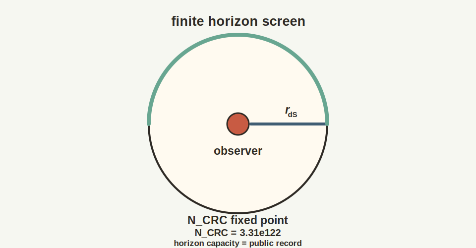

# Chapter 13: The de Sitter Patch

## 13.1 The Intuitive Picture: The Universe Is Static or Decelerating

Start with the old cosmological picture.

The universe is either static, with things staying roughly as they are, or
decelerating, with gravity pulling everything together and slowing expansion.
This is the natural expectation from Newton through Einstein.

Einstein himself added a "cosmological constant" to his equations in 1917 to create a static universe, a universe that neither expanded nor contracted. When Hubble discovered the universe is expanding, Einstein dropped the constant, calling it his "greatest blunder."

Even after accepting expansion, the expectation was deceleration. Gravity attracts. The mutual pull of all the matter in the universe should slow the expansion, like a ball thrown upward gradually slowing. Eventually, the expansion might stop or even reverse.

Supernova data broke that picture.

## 13.2 The Surprising Hint: The Universe Is Accelerating

### The 1998 Supernova Observations

In January 1998, two teams of astronomers independently announced results that overturned our understanding of the cosmos.

Saul Perlmutter led the Supernova Cosmology Project. Brian Schmidt and Adam Riess led the High-Z Supernova Search Team. Both groups had spent years hunting Type Ia supernovae-the "standard candles" of cosmology.

Everyone expected to find that expansion is slowing. The data showed the opposite.

Distant supernovae were fainter than expected-farther away than a decelerating universe would predict. The universe isn't slowing down. It's **speeding up**.

Something is pushing the cosmos apart. Something is fighting gravity and winning. The teams called it "dark energy."

The supernova result also rested on older work. Henrietta Leavitt's study of
Cepheid variable stars gave astronomy a way to climb the cosmic distance
ladder. Edwin Hubble's expansion law made the universe dynamical. Walter Baade,
Allan Sandage, Vera Rubin, Kent Ford, and many others sharpened the large-scale
picture long before the 1998 teams found acceleration. Cosmology is a relay
race. The de Sitter clue entered this book through a century of measurements,
calibrations, and arguments about what the sky was actually saying.

### The Cosmological Constant Returns

A positive cosmological constant Lambda > 0 creates a repulsive large-scale tendency that grows with distance. At early times, when matter density was high, gravity dominated. As the universe expanded and matter diluted, Lambda took over.

The expansion began accelerating about 5 billion years ago. The universe is about 68% dark energy.

The universe has a positive cosmological constant. It is accelerating toward a de Sitter future.

## 13.3 The First-Principles Reframing: De Sitter Is the Natural Screen

The deeper question is why the universe settled into a de Sitter patch.

### The Static Patch

What does one observer actually experience in de Sitter space?

As you look outward, galaxies recede faster and faster. At a critical distance $r_H = c/H$, the recession velocity equals the speed of light. Beyond this radius, light can never reach you.

Here $H$ is the Hubble expansion rate for the de Sitter phase. The formula says
that expansion itself creates a distance beyond which signals cannot overcome
the stretching of space.

This defines your **cosmological horizon**-the boundary of your causal access.

{width=78%}

Inside the horizon, you can use static coordinates. This region-the **static patch**-is all of de Sitter space that you can ever access.

### De Sitter Fits OPH

**The de Sitter horizon is the natural holographic screen.**

The fit is tight. Observers have finite patches, and the static patch
is bounded by a horizon. The patch boundary is an $S^2$, exactly the geometry
the framework wants. The entropy is finite through the Gibbons-Hawking area
law. No observer sees beyond the horizon, so there is no God's-eye view.
Observer equivalence is built in because de Sitter is maximally symmetric.
Time is patch-dependent because there is no preferred global clock.

The static patch is the natural arena for physics from an observer's perspective.

## 13.4 The Gibbons-Hawking Temperature

In 1977, Gary Gibbons and Stephen Hawking proved that the cosmological horizon radiates like a black body:

$$T_{dS} = \frac{\hbar H}{2\pi k_B}$$

For our universe, this is about 10^{-30} Kelvin-undetectable. During inflation, horizon-scale quantum fluctuations were stretched and later seeded structure formation; the de Sitter temperature is one thermodynamic way of characterizing that regime.

The symbols echo earlier horizon physics. $T_{dS}$ is the de Sitter
temperature. $\hbar$ is Planck's constant divided by $2\pi$. $H$ is the Hubble
rate for the de Sitter phase. $k_B$ is Boltzmann's constant, which converts
energy units into temperature units. The denominator $2\pi$ is the same
circle factor that appears in Unruh and Hawking horizon temperatures.

This temperature does not mean that empty space is glowing brightly around us. It means that an observer confined to one static patch sees the horizon as a thermal environment. Part of the quantum state is inaccessible beyond the horizon, and that loss of access has the same thermodynamic signature that horizons have elsewhere in gravitational physics.

### Why This Temperature? The Unruh Connection

The Gibbons-Hawking and Unruh formulas are closely related, but the identification has to be stated carefully.

A geodesic observer at the center of the static patch has zero proper acceleration, while a generic observer held at fixed radius has a radius-dependent proper acceleration. Near a horizon, the local de Sitter temperature reduces to the corresponding Unruh form:

$$T_U = \frac{\hbar a}{2\pi c k_B}$$

So the de Sitter and Unruh temperatures are locally linked, but they should not be identified by assigning every static-patch observer the same acceleration $a = cH$.

This has an important implication for OPH: **de Sitter horizons satisfy the same thermodynamic relations as Rindler horizons**. This is standard Gibbons-Hawking thermodynamics.

### Finite Entropy

If the horizon has temperature, it must have entropy:

$$S_{dS} = \frac{A}{4\ell_P^2} = \frac{\pi c^5}{G\hbar H^2}$$

This is the entropy associated with one de Sitter static patch-the logarithm of the effective number of states accessible within that patch.

Here $A$ is the horizon area, $\ell_P$ is the Planck length, $c$ is the speed
of light, $G$ is Newton's gravitational constant, and $H$ again sets the
de Sitter expansion rate. The first expression is the area law. The second is
the same law after writing the horizon radius in terms of $H$.

For the late-time horizon of our universe, $R_{dS} \approx 1.66 \times 10^{26}$ m. The bare radius-squared count is

$$N_{\text{patch}} = \left(\frac{R_{dS}}{\ell_P}\right)^2 \approx 1.05 \times 10^{122}.$$

The entropy capacity includes the area factor:

$$N_{\text{scr}} = S_{dS} = \pi N_{\text{patch}} \approx 3.31 \times 10^{122},$$

or about $4.77 \times 10^{122}$ bits.

That is the practical meaning of the formula. It is a capacity statement. The patch does not contain an infinite amount of information hidden in a smooth continuum. It contains a finite number of distinguishable states, and the area of the horizon tells you how large that state space can be.

This finite entropy has major implications. An observer's accessible patch has a
finite information capacity. The smooth continuum starts to look like an
effective description laid over a screen with a hard budget.

### Why This Matters for Gravity

Jacobson's derivation of Einstein's equations requires horizons with a
temperature proportional to surface gravity, an entropy proportional to area,
and a first law tying heat to entropy. De Sitter thermodynamics supplies that
structure. In OPH it becomes the natural thermodynamic backdrop for the
gravity relation recovered from observer-patch consistency.

## 13.5 The Problem of Time in De Sitter

In Anti-de Sitter space, there's a boundary at spatial infinity that provides a universal time reference.

De Sitter has no spatial boundary. The only boundary is the horizon-and the horizon is observer-dependent.

### Horizon Complementarity

Leonard Susskind and collaborators proposed **de Sitter complementarity**: operationally, physics should be described patch by patch, without privileging a single global observer description.

Alice describes physics in her patch using her Hilbert space. Bob describes physics in his patch using his Hilbert space. Where their patches overlap, their descriptions must be consistent. In the complementarity reading adopted here, patch-relative descriptions are primary.

A Hilbert space here is not a private mental space. It is the quantum state
space for the degrees of freedom accessible inside one observer's horizon.

This fits naturally with OPH. Reality is a collection of consistent patches. You can't step outside and view the universe from nowhere.

## 13.6 Static Patch Holography

Where should we put the holographic screen in de Sitter?

A natural candidate: on the cosmological horizon.

For an observer at $r = 0$, the horizon is a sphere at $r = c/H$. This sphere has area $4\pi c^2/H^2$ and the entropy capacity above.

The three-dimensional bulk inside the horizon is treated holographically as data organized on the two-dimensional horizon.

When an object falls toward the horizon, it gets redshifted and appears to freeze onto the surface, its information smeared across the screen.

The horizon is the natural screen for cosmology. It is the last place where
an observer can still trade signals with the rest of the patch. If physics is
organized around what observers can compare, then the cosmological horizon is
exactly where that comparison structure has to live.

### Why This Is Not dS/CFT

When physicists say "de Sitter holography is unsolved," they typically mean: no AdS/CFT-like duality with a clean boundary CFT at infinity is available. The classic dS/CFT proposal puts a Euclidean CFT at future infinity. This leads to notorious problems: potential non-unitarity, complex weights, and no clear operational access for any observer.

OPH takes a different path. It uses static-patch holography with
positive Lambda. The boundary is the observer's horizon, not future infinity.
The construction asks for local algebras and overlap consistency, without one
global CFT. Each observer has a horizon screen, and observer-dependence is
part of the setup.

This is a different target. The "unsolved problem" of dS holography is about finding a global boundary theory at infinity. OPH asks how local observer patches, each bounded by a horizon, yield consistent physics.

### Lambda as Global Capacity

A crucial insight: the cosmological constant is not a local patch datum. Null
modular probes reconstruct the stress tensor only up to a term proportional to
the metric itself, so $\Lambda g_{ab}$ enters as the one global scale the local
construction cannot erase.

The symbol $\Lambda$ is the cosmological constant, the part of Einstein's
equation that acts like a uniform large-scale tendency for space to accelerate.
It is global capacity data on the input-dependent screen-capacity branch, not
one more local particle-physics coupling.

So on the input-dependent cosmological-capacity branch Lambda is fixed by a
**global** constraint: the total capacity of the screen. In natural units,
once $N_{\mathrm{scr}}=\log(\dim \mathcal{H}_{\text{tot}})$ is supplied, the
relationship is:

$$\Lambda = \frac{3\pi}{G \cdot \log(\dim \mathcal{H}_{\text{tot}})}$$

With that global input declared, the observed $\Lambda$ is the way the world
announces its total screen capacity. It is the global size parameter carried
by every consistent patch.

The symbol $\mathcal H_{\text{tot}}$ means the total Hilbert space available to
the screen, and $\dim$ means its dimension, the number of independent quantum
state directions before taking the logarithm. The logarithm converts that
dimension into entropy. This equation is not a local particle-mass formula. It
is a capacity formula: a larger total state space corresponds to a smaller
positive cosmological constant.

### Many Observers, One Lambda

The philosophical stance of OPH, no objective camera angle and only perspectives that must agree on overlaps, maps naturally onto de Sitter static-patch intuition. Each timelike observer has a horizon and a patch. There is no operational access to a single global description.

On that same input-dependent branch, Lambda is the global quantity that
**can** be shared across overlaps. It is a capacity constraint that all
consistent overlapping descriptions inherit. Different observers see
different patches, and they all see the same Lambda encoded in the finite
size of their horizons.

### The Cosmology Picture

The cosmology picture is easiest to state in plain language. When the
entropy-maximizing state is rotationally symmetric for an observer, the
large-scale stress tensor looks like a perfect fluid. When the same isotropy
holds across observers, the spatial slices have constant curvature. Combined
with the gravity relation from the earlier chapters and a positive
cosmological constant, that gives the familiar FLRW geometry used in
cosmology.

## 13.7 Scrambling and Chaos

De Sitter space is a **fast scrambler**-perhaps the fastest possible.

Information sent toward the horizon gets thermalized, mixed with all the other quantum information. The scrambling time is:

$$t_{scrambling} \sim \frac{1}{H}\ln S \sim \frac{280}{H}$$

For our universe, this is about 4 trillion years. Black holes are the standard saturators of the chaos bound in holographic settings, and de Sitter is often discussed as a fast-scrambling horizon with analogous scaling.

$t_{scrambling}$ is the time needed for initially localized information to
become thoroughly mixed across the horizon degrees of freedom. The symbol
$\sim$ means "scales like," not exact equality. $S$ is the de Sitter entropy.
The number 280 comes from the logarithm of the huge entropy associated with
our late-time horizon.

The smooth, empty appearance of the de Sitter vacuum can be read as highly scrambled information in this perspective.

## 13.8 The Swampland and Anthropic Selection

String theory has difficulty producing stable de Sitter vacua.

Swampland arguments suggest that stable de Sitter vacua may be impossible in consistent quantum gravity. If true, our universe would be slowly rolling down a potential hill.

Even if de Sitter vacua exist, why is Lambda so small (10^{-122} in Planck units)?

The **anthropic principle** offers an answer: if Lambda were much larger, galaxies couldn't form. If it were negative, the universe would recollapse. We find ourselves in a universe with small positive Lambda because that's where observers can exist.

## 13.9 Reverse Engineering Summary

Older cosmology expected expansion to slow under gravity. The sky disagreed.
The supernova data and positive cosmological constant point
toward de Sitter behavior, and de Sitter fits the observer-first picture with
almost suspicious neatness. Each observer has a static patch, a horizon, a
temperature, an entropy budget, and finite accessible information. The
cosmological horizon is not a nuisance in this reading. It is the natural
screen.

## 13.10 Dark Sector as a Modular Anomaly

There's another cosmic mystery we haven't addressed: dark matter. Galaxies rotate too fast. Galaxy clusters hold together too tightly. The cosmic microwave background fluctuations require extra gravitational pull. The standard explanation: invisible particles that interact gravitationally but not electromagnetically.

OPH suggests a different route.

### The Modular Anomaly

In Chapter 11, we saw that a first-variation Einstein relation emerges from an entanglement-equilibrium argument in the scaling regime, and that the same branch can be upgraded to the semiclassical Einstein equation. The continuation below is not part of that recovered-core gravity chain. It asks what happens when one moves away from the ideal recoverability limit.

In the phenomenological continuation considered here, the Markov condition is treated as only approximate. Some residual correlation is then not perfectly captured by the boundary alone. That imperfection is packaged as an extra term:

$$K_C = 2\pi B_C + K_C^{(\text{anom})} + \text{const}$$

where the "anomaly" captures the deviation from perfect modular additivity. This anomaly contributes to the stress-energy:

An anomaly here means a controlled leftover term, not a mistake. It is what
remains when the ideal additivity of the modular bookkeeping is only
approximately true.

$K_C$ is the modular Hamiltonian associated with cap $C$. $B_C$ is the
geometric boost-like generator that would appear in the ideal local form.
$K_C^{(\text{anom})}$ is the extra contribution left when the ideal Markov
recovery condition is imperfect. The constant shifts the zero of modular
energy and has no direct observational role.

$$G_{00} + \Lambda g_{00} = 8\pi G \left( \langle T_{00} \rangle + \langle T_{00}^{\text{anom}} \rangle \right)$$

The continuation highlighted here uses the coefficient $\frac{15}{8\pi^2} \approx 0.19$.

### Why This Is "Dark"

In this continuation, the anomalous term $T_{00}^{\text{anom}}$ is dark at the
level of its couplings. It arises from information structure rather than
Standard Model fields, it gravitates, and it carries no direct electromagnetic
coupling in the effective description.

### The Acceleration Scale

The de Sitter horizon introduces an unavoidable IR length scale:

$$r_{dS} = \sqrt{\frac{3}{\Lambda}} \approx 1.66 \times 10^{26} \text{ m}$$

Galaxy rotation anomalies are an infrared phenomenon. They appear at large distances where accelerations are tiny. Any modification from the modular anomaly must be controlled by this scale.

A natural acceleration benchmark, carrying the anomaly coefficient, is:

$$a_0^{(\text{OPH})} = \frac{15}{8\pi^2} \cdot \frac{c^2}{r_{dS}}$$

Plugging in numbers:

$$a_0^{(\text{OPH})} \approx 1.03 \times 10^{-10} \text{ m/s}^2$$

This lands near the empirical MOND acceleration scale
$a_0 \sim 1.2 \times 10^{-10}\,\text{m/s}^2$ that fits galaxy rotation curves.
The proximity matters because it ties galaxy-scale anomalies back to the same
de Sitter capacity logic that fixed the horizon.

### What This Continuation Looks Like

If the modular anomaly is read as part of the dark sector, one MOND-like
continuation takes a familiar deep-infrared form. In the regime where $g<a_0$,
the effective gravitational acceleration is written as

$$g_{\text{obs}} \approx \sqrt{a_0 \cdot g_b}$$

where $g_b$ is the Newtonian acceleration from baryons. For a galaxy this gives
the flat-rotation-curve behavior astronomers actually see.

$g_{\text{obs}}$ is the effective acceleration inferred from the observed
rotation curve. $g_b$ is the acceleration expected from visible baryonic matter
alone: stars, gas, and dust. $a_0$ is the acceleration scale supplied above by
the de Sitter horizon. The square root is the same scaling that makes flat
galaxy rotation curves lead to the baryonic Tully-Fisher relation.

The same picture yields the baryonic Tully-Fisher relation:

$$V^4 = G \cdot M_b \cdot a_0^{(\text{OPH})}$$

This is the observed Tully-Fisher form that the continuation aims to
reproduce, with its normalization benchmark set by screen capacity. In that
phenomenological branch, the dark sector is read as an infrared correction to
gravity rather than a new species of particle. The cosmological constant and
the galaxy-scale anomaly then sit inside one de Sitter picture, but the
galaxy-scale response law itself is not part of the recovered-core theorem
package.

---

The arena is a finite static patch bounded by a holographic horizon. What populates this arena? What are the particles and forces we observe, and why do they have the peculiar properties they do?

The next chapter treats the Standard Model of particle physics as an effective structure. It **emerges from consistency requirements**: the gluing conditions between observer patches force gauge symmetry, and the requirement for anomaly-free gluing determines the particle content.

This is **Chapter 14: The Standard Model from Consistency**.
