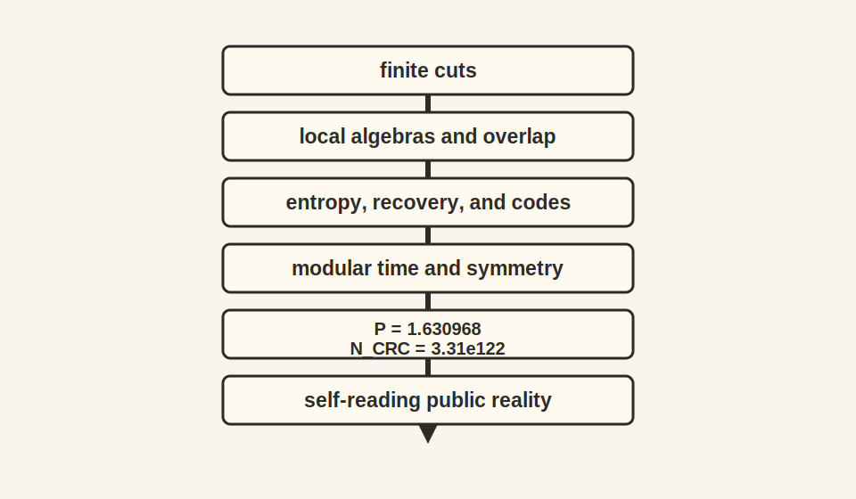

# Chapter 18: Synthesis

## 18.1 The Picture That Gives Way

For a long time physics assumed a finished stage. Space was the
container. Time was the clock hanging above it. Matter moved through both.
Observers arrived late, as witnesses standing at the edge.

The twentieth century kept cracking that image. Black holes stored entropy on
surfaces. Quantum mechanics refused to hand out a hidden answer key. Horizons
cut every observer off from part of the world. Time lost its absolute status.
The Standard Model looked powerful and fragile at once, full of symmetry and
fine balance. The message hidden inside all of this was easy to miss. The old
starting point was too simple.

No one person found that message. It was assembled from many traditions:
thermodynamics, quantum theory, relativity, information theory, algebra,
particle physics, cosmology, condensed matter, computation, and experimental
engineering. Some names have appeared in this book because a story needs
handles. Behind each handle sits a field of technicians, students, instrument
builders, theorists, critics, and data analysts. OPH is best read in that
spirit. It is a proposed synthesis of accumulated constraints, not a rejection
of the accumulated work.

## 18.2 The Observer-First Turn

This book takes the hint seriously. Physics begins with finite observers,
finite access, and the demand that overlapping descriptions agree.

That turn changes the tone of everything that came before. Objectivity ceases
to be a mysterious substance sitting behind all perspectives. It becomes the
shared account that survives comparison. A world becomes public when many local
views can be woven into one durable account.

The horizon matters. It is where comparison becomes physical. It is
where records meet. It is where the bookkeeping has to close.

## 18.3 The Screen and the Ledger

The fundamental image is simple enough to keep in your head. Picture a
two-sphere carrying finite quantum data. No observer sees the whole sphere at
once. Each observer lives on a patch. Where patches overlap, the observables on
that overlap have to match.

The state on the screen is selected by maximum entropy subject to a stable
local family of constraints. Generalized entropy gives each cap both a bulk
piece and a boundary piece. The least elaborate low-energy matter sector that
respects those constraints is the one the world settles into. Once those three
moves are in place, the whole architecture becomes legible.

This is the hidden spine of the book. Overlap gives the rule. Entropy gives the
selection principle. Minimality gives the economy.

{width=78%}

## 18.4 How Spacetime Appears

Once cap modular flow becomes geometric, time stops looking imported from
outside. It becomes the internal flow attached to a restricted state. When
those local flows fit together across the smooth screen, Lorentz kinematics
appears. When generalized entropy sits at equilibrium under the allowed
MaxEnt variations of a fixed cap, the Einstein relation appears as the public
large-scale grammar of that equilibrium.

Read that sentence as a compressed recap. Modular flow is the clock a restricted
state carries. Lorentz kinematics is the rulebook for relating moving
observers. Generalized entropy is the horizon-plus-bulk entropy accounting that
gravity has to respect.

In plain language, spacetime is the compressed way finite observers keep track
of how their clocks, horizons, and correlations line up. Geometry is what the
shared bookkeeping looks like when written smoothly.

## 18.5 How the Particle World Appears

The particle world follows the same logic from another angle. Once fixed-cutoff
charge sectors can fuse, split, carry duals, persist coherently under
refinement, and descend with compatible finite-dimensional multiplicity spaces,
the gauge group is reconstructed from that persistent charge bookkeeping
itself. On the realized one-Higgs matter branch, the group that emerges is

$$
SU(3)\times SU(2)\times U(1)/\mathbb Z_6.
$$

This quotient notation means that the strong, weak, and hypercharge symmetry
systems share a small common center that should not be counted six separate
ways. $SU(3)$ carries color, $SU(2)$ carries weak doublet structure, and
$U(1)$ carries hypercharge. The $\mathbb Z_6$ quotient is the discrete
identification that makes the Standard Model charge lattice fit together.

The color triplet follows from the minimal coupled carrier, and the
three-generation count follows from CKM phase counting, weak-sector
consistency, and minimality on the same low-energy branch. The photon,
gluons, and graviton stay massless because they ride on redundancy directions
the architecture cannot break. The broader particle table then carries the
weak-sector compare-only validation pair, the low-energy electromagnetic endpoint, the
declared Higgs/top quantitative surface, the selected-class quark sector, and
one weighted-cycle neutrino theorem branch. The technical status ledger separates charged-lepton
witnesses, the global public quark-frame classification boundary, the
auxiliary direct-top compare-only codomain, source-only hadron calculations,
and empirical hadron closure checks. Hadrons add the strong-binding problem on
top of that particle-level picture.

The particle words here refer to roles explained in Chapters 12-16: color is the
three-way strong-force bookkeeping, CKM phases describe quark mixing under the
weak interaction, and hadrons are composite particles such as protons and
neutrons.

That is the twist. The Standard Model stops looking like a cabinet full of
unrelated entries. It looks like the smallest charged world that lets the
observer records close.

## 18.6 One Global Size and One Local Ruler

The quantitative side of the framework turns on two scales with very different
roles.

The first is global. On the input-dependent screen-capacity identification branch, the observed
cosmological constant fixes the total screen capacity, about
$3.31\times10^{122}$ natural entropy units, or about $4.77\times10^{122}$
bits. That gives the size of the accessible computation and sets the de Sitter
horizon scale.

The second is local. The pixel ratio

$$
P=\frac{a_{\mathrm{cell}}}{\ell_P^2}
$$

acts as the ruler from which the electroweak scale, the low-energy
electromagnetic coupling, and the gravity-facing readout are displayed.

$a_{\mathrm{cell}}$ is the effective area assigned to one screen cell.
$\ell_P$ is the Planck length. Dividing by $\ell_P^2$ makes $P$
dimensionless: it is a pure ratio between the cell area and the Planck-area
unit.

The striking part is that this local ruler can be read from two sides of the
same world. Feed a trial value of $P$ through the electroweak chain and the
theory returns an inner electromagnetic observation scale. Closure asks for the
value of $P$ where the outer pixel reading and the inner observational reading
agree:

$$
P=\phi+\alpha_{\mathrm{in}}(P)\sqrt{\pi}.
$$

The computation has a definite order. The golden-ratio balance gives the
reference value $\phi$. The boundary Gaussian normalization gives the
$\sqrt{\pi}$ width. A trial $P$ is sent through the source map for the
unification scale, the running gauge couplings, and the electroweak anchor. The
unbroken electromagnetic channel is then transported to the long-distance
Thomson endpoint. The fixed point is the value where

$$
P=\phi+\frac{\sqrt{\pi}}{A_T(P)}
$$

with $A_T(P)=\alpha_{\mathrm{em}}^{-1}(0;P)$.

The symbol $\phi$ is the golden ratio. $\alpha_{\mathrm{in}}(P)$ is the
inner electromagnetic readout produced when the trial pixel value $P$ is sent
through the OPH transport chain. $A_T(P)$ is the Thomson-limit inverse
electromagnetic coupling computed from that trial value. The fixed point is
the value of $P$ for which the geometric pixel and the electromagnetic readout
name the same local scale.

The value is forced in OPH because the same cell cannot choose one value for
its geometry and another value for electromagnetic observation. The
fine-structure constant is the electromagnetic width that makes both readings
describe the same local pixel.

This is the cleanest way to say what the fine-structure constant means in OPH.
It is the nonzero detuning of a holographic screen cell. From the outside, the
cell is displaced from perfect self-similar equilibrium. From the inside, the
same displacement appears as the smallest electromagnetic observation scale
available to the observers living on that screen.

Perfect equilibrium would be too quiet. A world with records needs a small
departure from silence: enough asymmetry for light, detectors, and durable
differences, yet small enough for the screen geometry to remain coherent. The
fine-structure constant measures that minimal electromagnetic disturbance.

The long-distance fine-structure readout gives

$$
P\simeq1.6309682094
$$

and

$$
\alpha^{-1}(0)=137.035999177(21).
$$

The ellipsis means the decimal continues. The notation $(21)$ on
$\alpha^{-1}(0)$ means uncertainty in the last quoted digits. The number is
the inverse fine-structure constant at zero momentum, the low-energy
electromagnetic strength familiar from precision physics.

The source-only calculation gives inverse alpha
$136.9948351646\ldots$ at pixel $1.6309720956943290\ldots$. The displayed
endpoint uses the same OPH fixed-point equation with measured
\(e^+e^-\to\mathrm{hadrons}\) input for the empirical hadronic contribution.

The phrase $e^+e^-\to\mathrm{hadrons}$ names electron-positron annihilation
into strongly interacting composite particles. Those data help account for the
hadronic contribution to the long-distance electromagnetic running used in the
displayed endpoint.

Alex Osika's optical-cavity hardware work probes the same fixed-point geometry.
The apparatus is not a miniature universe. It is a controlled physical
implementation of the closure idea: a device whose geometry and readout are
forced to settle on one fixed point.

One cell on the screen is then being described twice. From one side it is a
pixel of the horizon. From the other it is the smallest electromagnetic step
available to observers inside the encoded world.

## 18.7 Why de Sitter Fits

The large-scale universe is accelerating. In OPH that matters
immediately, because de Sitter space gives every observer a natural horizon and
therefore a natural screen.

Different observers carry different horizons, yet those horizons overlap
enormously. The consistency conditions are severe. The total state space is
finite. On that same input-dependent branch, the cosmological constant stops
looking like an awkward vacuum-energy leftover and instead looks like a global
capacity statement about the screen.

The de Sitter chapter mattered so much because it did not break the thread. It
revealed the stage on which the observer-first picture reads most
cleanly.

## 18.8 Old Puzzles Under New Light

Several old puzzles change character at once.

The measurement problem softens because there is no wavefunction of the
universe being watched from outside. Measurement is one patch entering a new
record relation with another.

The problem of time softens because modular flow furnishes an internal
before and after. Time is local, real, and emergent in the same breath.

The black-hole information problem softens because the screen blocks any naive
splitting of the world into one autonomous inside and one autonomous outside.
Interior data is encoded, not stored in a second hidden vault.

Fine-tuning also changes tone. Once laws are read as the patterns that survive
across many overlapping perspectives, a law is not a command pinned onto
the universe from elsewhere. It is the shape that remains stable under the
harsh test of public consistency.

## 18.9 The Strange Loop

A more unsettling thought follows. Reality produces
observers. Observers produce understanding. Understanding can produce a working
image of the same informational structure that produced the observers in the
first place.

The simulation question lands differently here. The book does not
need an external programmer standing beyond the physics. The stronger image is
stranger. A world of finite observers can close back on itself through the very
minds it generates. The loop is conceptual before it is technological. It says
that a self-describing universe is not a joke or a metaphor. It may be the
natural way an observer-world becomes complete enough to understand its own
construction.

## 18.10 What the Book Has Been Saying

By this point the central sentence of the book can be spoken plainly:

**Reality is the consistency of observations across overlapping perspectives.**

Everything else unfolds from that pressure. Spatial geometry is organized by
entanglement structure. Time is modular flow read from inside restricted
states. Matter is the family of stable excitations that can survive transport
across patches.
Laws are the public regularities that endure repeated comparison. Objectivity
is the residue left behind after many partial viewpoints are made to agree.

The picture feels strange only if one insists on beginning with a finished world.
Begin with finite access, horizons, records, and overlap, and the twists stop
looking decorative. They start looking inevitable.

## 18.11 Final Synthesis

Reverse engineering starts with symptoms and works backward to architecture.
This book started with the symptoms modern physics could not stop producing:
area laws, entanglement, measurement tension, horizons, relativity, gauge
structure, and the peculiar fine balance of the particle world. It followed
those clues back to one architecture: a finite screen, local patches,
recoverability, modular flow, generalized entropy, and a world that holds
together because partial observers can keep agreeing.

That architecture does more than tidy up puzzles. It turns the universe into a
much stranger object than classical physics ever imagined. There is no view
from nowhere. There are views from somewhere, and a shared reality is what
appears when those views can lock into one coherent public record.

That is the human side of the synthesis as well. Physics advances because many
partial views are forced to meet. A detector group sees one artifact. A
mathematician sees an obstruction. A cosmologist sees a horizon. A quantum
information theorist sees a code. A good theory earns its keep by making those
views mutually legible without erasing their differences.

The structure is not a flat list. The gauge quotient, charge lattice, counting
chain, massless carriers, Lorentz geometry, Einstein relation, and the
tracked electroweak, Higgs-top, quark, and neutrino surfaces form one
organized reconstruction, not a catalog of unrelated facts.

The local-ruler ledger records five technical boundaries. The weak pair is a
validation row on a declared compare-only surface. Charged-lepton rows are
target-anchored same-family witnesses rather than source-emitted public
masses. The selected-class quark theorem closes only on its declared public
frame class, so global public quark-frame classification remains open. The
auxiliary direct-top PDG row remains compare-only. Hadron masses require the
OPH strong-binding backend with production spectral data and systematics.
The selected-class quark theorem leaves strong CP open: the available corpus
does not derive $\theta_{\mathrm{QCD}}$, does not emit physical $\bar\theta$,
and does not prove that the physical strong-CP phase vanishes.

The next chapter turns to the deepest interpretive question. If observers,
meaning, and world belong to one structure, what exactly should be said about
experience itself?
