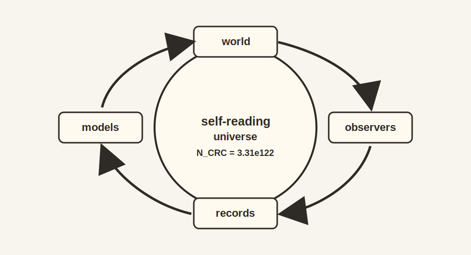

# Chapter 19: Metaphysics and Qualia

---

## 19.1 The Zombie That Couldn't Exist

In 1996, philosopher David Chalmers asked us to imagine a zombie. Chalmers meant a creature physically identical to you in every way, with the same neurons firing, the same behaviors, and the same words coming out of its mouth, and no one inside. No inner experience. No "what it's like" to be it. The lights are on, with no one watching.

Chalmers argued that such a zombie is *conceivable*. You can imagine it without contradiction. And if you can conceive of it, then consciousness must be something over and above the physical facts. This is the "hard problem": even if we mapped every neuron and explained every behavior, we'd still have to explain why there's *experience* at all.

The hard problem has haunted philosophy for three decades. Physicalists insist zombies are impossible; dualists see them as proof that mind transcends matter; mysterians throw up their hands and declare consciousness forever beyond human understanding.

OPH gives a different response: zombies are *incoherent*. The question assumes something that doesn't exist.

## 19.2 The Ether Move, One Last Time

Remember the luminiferous ether? Nineteenth-century physicists couldn't imagine light waves without a medium to wave *in*. They built elaborate theories about this cosmic jelly, measured its properties, debated its nature. Then Einstein showed that light doesn't need a medium. The ether wasn't invisible; it was *unnecessary*. The question "what are the properties of the ether?" had no answer because it was asking about something that didn't exist.

The hard problem has the same structure. It asks: "How does subjective experience arise from an objective physical world?"

What if there is no objective physical world for experience to arise from?

This is the conceptual shift we've been building toward throughout this book. There is no God's-eye view. There is no complete description of reality that exists independently of any observer. There are only observer perspectives, patches on the holographic screen, and "objective reality" is the structure that emerges when these perspectives must agree where they overlap.

Once you make this shift, the hard problem dissolves. Experience doesn't need to "arise" from anything. Every description is a view from somewhere, by someone. Subjectivity is the default, not the mystery.

## 19.3 Why Zombies Can't Walk

An observer patch *is* a perspective with an interior. That is what makes it an
observer. The patch has access to certain algebras of observables, maintains
certain records, and participates in consistency relations with other patches.
The "what it's like" is part of what patch-hood means from the inside.

A philosophical zombie would be a patch that does everything a conscious observer does, maintaining records, enforcing consistency, and participating in overlap agreements, while having no interior experience. In OPH, doing those things *is* having an interior experience. There is no gap between the function and the feel. The zombie concept tries to pry apart two things that were never separate.

This dissolves the hard problem by showing it rested on a false assumption: the idea that you could have a complete objective description and then ask where experience fits in. There is no such description. The most fundamental level is perspectival.

## 19.4 What the Model Doesn't Touch

Dissolving the hard problem is different from solving the easy problems. OPH says nothing about why *these* neural patterns correlate with *that* quale, why activity in V4 looks red while activity in auditory cortex sounds like music. V4 is a region of the visual cortex strongly associated with color processing. Those are scientific questions requiring empirical investigation. The framework removes the philosophical obstacle that made them seem impossible in principle.

Similarly, the model gives a structural way to discuss which physical systems count as observer patches. A thermostat, a bacterium, and a corporation can all be placed in the same consistency-and-record language, even though they occupy very different levels of organization.

## 19.5 The Measurement Problem Evaporates

Quantum mechanics has its own philosophical zombie: the measurement problem. In standard presentations, the Schrödinger equation evolves quantum states smoothly and deterministically, until someone "measures" them, at which point the wavefunction mysteriously "collapses" to a definite value.

But what counts as a measurement? When exactly does collapse happen? Does consciousness cause collapse, as some early physicists speculated? The interpretations multiply: Copenhagen, many-worlds, pilot waves, objective collapse, relational quantum mechanics, QBism. Each tries to explain how an objective quantum state connects to the definite outcomes observers actually see.

OPH cuts through this by removing the problematic assumption: that the measurement problem is about a single observer-independent state description that must somehow connect to lived experience.

The formalism can still contain a global quantum state, but no observer occupies
a God's-eye position outside the system. What observers actually have are
patch-level descriptions. At book level, a superposition is a description that
still admits multiple compatible continuations. When two patches that had no
shared access come to share access to a system, their descriptions must agree
on that overlap. That shared record relation is what the chapter is calling
"measurement." "Collapse" is the patch-level update into a definite public
record.

At the observer-first level developed here, the measurement problem softens
because there is no physically occupied view from nowhere whose wavefunction
must then be connected to experience. There are perspectives that have to
synchronize through shared records.

## 19.6 Why These Laws? Why This Universe?

One question keeps physicists and philosophers up at night: Why does the universe have the specific laws it does? Why these particles, these forces, these constants?

The standard framing assumes laws are eternal Platonic truths, mathematical
structures that exist independently of physical reality and somehow "govern"
it. But then their specific form becomes inexplicable. Why should the
low-energy fine structure constant land near $1/137$, more precisely at
$\alpha^{-1}(0)=137.035999177(21)$? Why three spatial
dimensions, not four or seven?

The fine-structure lane treats the public Thomson-limit value as a fixed-point
readout of the same local screen cell. The local
pixel ratio $P=a_{\mathrm{cell}}/\ell_P^2$ is given two readings. From outside
the encoded world, $P$ is the area of one screen cell in Planck units, sitting
slightly above the exact golden-ratio balance point $\varphi$. From inside the
encoded world, the same displacement is read as the smallest electromagnetic
observation strength available to observers. The closure condition is

$$P=\varphi+\alpha_{\mathrm{in}}(P)\sqrt{\pi}.$$

Here $\alpha_{\mathrm{in}}(P)$ is the inside electromagnetic observation
strength. The source-side computation sends the same trial pixel through the
unification scale, running gauge couplings, electroweak anchor, and
Ward-projected electromagnetic endpoint. The fixed point gives

$$P\simeq1.6309682094.$$

with

$$\alpha^{-1}(0)=137.035999177(21).$$

The constant represents the electromagnetic width of the smallest
observer-supporting pixel. Its value is forced because the inside and outside
descriptions of that pixel have to land on the same number.

The symbol $\varphi$ is the golden ratio. $P$ is the pixel area ratio
$a_{\mathrm{cell}}/\ell_P^2$, the area of a screen cell in Planck-area units.
$\sqrt{\pi}$ is the boundary Gaussian normalization used in the local
ruler discussion. The inverse $\alpha^{-1}(0)$ is the long-distance
fine-structure readout. The parenthesized digits again indicate the quoted
uncertainty in the final digits.
For the displayed Thomson endpoint, the hadronic spectral contribution has a
separate empirical \(e^+e^-\to\mathrm{hadrons}\) payload class. The source-only
calculation is kept in the technical table.

Here the philosophical point is that a famous "free
constant" is tied to the same local screen scale that organizes the particle
sector.

Some invoke the anthropic principle: the constants must be compatible with observers existing, or we wouldn't be here to ask. But this feels like giving up on explanation.

OPH gives a different picture. Laws are not eternal truths imposed from outside. They are survivors of a selection process. The consistency constraints that must hold for observer patches to coherently glue together filter the space of possible physics. Most candidate laws fail: they create inconsistencies, they can't form stable observers, they don't survive comparison across patches. The laws we see are the ones that passed the filter.

This is a structural selection principle. The universe is compatible with us
because we are the kind of thing that can exist in a universe that passes the
consistency filter. The "fine-tuning" is what survival looks like.

## 19.7 The Deepest Question

Why does anything exist at all?

This is the oldest question in philosophy. Leibniz asked it. Heidegger called it the fundamental question of metaphysics. It seems unanswerable: any explanation of existence would itself be something that exists, requiring further explanation.

Notice the hidden assumption: that "nothing" is the default state, and existence requires justification. OPH inverts this.

Consider: what would "nothing" actually look like? Not empty space (that's still something, with geometry and quantum fields). True nothing would be the absence of all structure, all information, all distinction. But a state with no information *is* indistinguishable from random noise. It has no features that could distinguish it from anything else.

The process described by OPH, observer patches enforcing consistency and
carving stable structures from the space of possibilities, is precisely how
*something* emerges from what would otherwise be undifferentiated noise. The
first moment of meaning arrives when one piece of data becomes causally
connected to another, when a distinction makes a difference. Before that mutual
information exists, there is no "there" there.

Some philosophers have called this "selector theory": non-existence isn't the natural default that existence must overcome. Rather, undifferentiated nothing and structured something lie on a continuum, and the consistency constraints we've described are what carve out the structured regions.

Others have spoken of "strange loops," reality creating itself through self-reference, like a hand drawing the hand that draws it. OPH gives this intuition formal backing: the axioms support a self-consistent structure in which both the states and the laws that govern them emerge together, like a universe that writes its own operating system.

There is a deeper version of the same idea. Reality may permit a strange-loop interpretation.

This is also the point where OPH intersects most directly with what popular
culture calls **simulation theory**. The book does not picture the universe as
a videogame running on somebody else's laptop. It treats physical reality as a
self-consistent information process, which is why OPH is publicly framed both
as a concrete implementation of simulation theory and as a concrete theory of
everything.

Consider the trajectory: reality is computational. Within this computation, physical evolution produces complex structures. Biological evolution produces minds. Memetic evolution produces ideas. Among these ideas, the understanding of reality's computational nature eventually emerges. Armed with this understanding, observers can simulate reality itself.

The strange-loop hypothesis is sharper: **reality may evolve observers who discover how reality works and simulate it, closing the loop of self-creation**.

We are not watching from outside. We are patterns within a self-simulating system. The simulation runs on itself, through us, through our understanding. Escher's hands draw each other. Reality simulates the observers who simulate reality.

Why does this loop exist at all? One possible closure picture is that a
self-consistent strange loop is a particularly stable configuration. On that
reading, "nothing" cannot maintain itself because it has no structure to
persist, while a self-referential loop can.

This loop is structural. It is a relation among reality, observers, and the
simulation they eventually understand how to build. Time is subjective. It
emerges from modular flow within observer patches. The strange loop is not best
pictured as an ordinary temporal sequence with one stage literally preceding
the next. The "cause" and the "effect" are aspects of the same
self-consistent structure.

This resolves the apparent paradox of self-causation. You cannot cause yourself in time, because that would require existing before you exist. But you can be part of a self-consistent structure that has no temporal "before." The loop does not happen *in* time. Time happens *in* the loop.

## 19.8 The View from Nowhere

Thomas Nagel wrote a famous book called *The View from Nowhere*, exploring the tension between objective and subjective perspectives. Science seems to demand a God's-eye view, a description from no particular vantage point. Yet we can never actually achieve such a view. We're always somewhere, looking at things from a particular angle.

This tension generates most of the problems we've discussed: consciousness, quantum measurement, fine-tuning, existence. They all assume you can stand outside reality and ask how it works, then puzzle over how your standing-inside experience fits the picture.

The observer-first reading drops the view-from-nowhere assumption. There is no perspective-free inventory waiting behind every local viewpoint. There are only views from somewhere: patches on the holographic screen, finite observers, and the records they can compare. Objectivity is the overlap-stable summary of those partial views.

{width=78%}

The consistency constraints are rigid. Not every perspective survives. The
physics we discover is the physics that can be coherently maintained across the
surviving network of perspectives. That's why it is so reliable and
predictive. It has been filtered by the harsh criterion of public
self-consistency.

## 19.9 The Hacker and the Hacked

We began this book with a metaphor: physicists as reverse engineers, taking apart reality to understand how it works. We've traced that project through quantum mechanics and relativity, through gauge symmetry and entanglement, through the holographic screen and the emergence of spacetime.

But the deepest discovery isn't any particular equation. It's this: the reverse engineer is part of the system being reverse engineered. The observer is on the screen. The hacker and the hacked are one.

This can sound mystical until the physics is followed all the way down. If
there is no perspective-free perch outside the system, then the scientist
describing reality is a pattern within reality describing itself. The strange
loop closes there.

The weirdness of quantum mechanics, the relativity of simultaneity, the holographic encoding of information, the emergence of spacetime from entanglement: none of these are bugs to be fixed. They're features pointing at the truth. Reality isn't made of objects in a void observed from outside. It's made of perspectives, consistency relations, and the structure that emerges when finite observers must agree.

## 19.10 The Tests Ahead

The philosophical picture earns its weight only when it keeps making contact
with physics. The deep questions are clear: whether overlap consistency can be
formalized as a complete sheaf condition, whether quantum structure itself can
be forced by consistency, whether spacetime dimensionality can be driven instead
of assumed, whether dynamics can grow out of synchronization pressure, and
whether the pixel area and screen-capacity inputs can be folded back into first
principles. The chapter treats these as pressure points where metaphysics and
physics meet.

A sheaf condition is the mathematical version of a simple demand: local
descriptions that agree on their overlaps should glue into one consistent
description. That is the formal cousin of the book's observer-overlap rule.

### Philosophy After the Equations

The final metaphysical move should preserve the mathematics that made it
possible. The book makes a constrained claim: experience is patch-internal,
and public reality is overlap-stable. A private impression becomes a public
fact only if it can be anchored in records, compared through shared interfaces,
and kept coherent with the rest of the world.

That lets older philosophical language be translated into technical pressure.
The "view from nowhere" becomes the demand for a global description that no
finite observer actually occupies. A "phenomenal point of view" becomes the
inside of a bounded, record-making process. A "law of nature" becomes a
stable regularity that survives comparison across patches. A "meaning" is no
longer a label attached from outside the universe. It is a pattern stabilized
inside the universe by observers who remember, interpret, and coordinate.

This is why the chapter treats sheaves as more than a mathematical aside. A
sheaf begins with local data. If the local descriptions agree on overlaps, a
global section may be glued. If they do not agree, the obstruction is real.
Translated back into the book's language, objectivity is the successful
gluing of perspective-bound descriptions. The metaphor is not perfect because
quantum states, non-commuting algebras, and recoverability add extra
structure. But the sheaf image captures the discipline: local agreement is
the route to public world, and failed agreement is a diagnostic, not an
embarrassment.

The strange-loop language also needs discipline. Douglas Hofstadter used
strange loops to describe systems that climb levels and return to themselves.
Godel's theorem is one mathematical inspiration, Escher's drawings are a
visual one, and self-reference in computation is another. OPH's loop is not a
claim that the future causes the past in ordinary time. It is a structural
claim: a world can produce observers who model the world, and those models
can become part of the same world they describe. From inside subjective time
that feels like a history. From the full structural view it is a
self-consistency condition.

The humility here is important. The metaphysical reading is a continuation of
the physics, not a replacement for it. If the overlap conditions fail, if the
particle ledger fails on its declared surfaces, if the dark-sector
continuation fails, or if the recoverability claims cannot be sharpened, the
interpretation must change.
That is a feature. A metaphysics worthy of physics should remain exposed to
physics.

## 19.11 Reverse Engineering Summary

The metaphysical picture follows the same turn made in the physics chapters.
Experience is the interior of observer patches. Measurement is the
synchronization of partial descriptions. Laws are the stable survivors of
consistency filters. Even the question of existence changes shape once one
stops asking for an external cause standing outside the whole structure.

## 19.12 God, Meaning, and Participation

The observer-first picture leaves little room for a personal God standing outside the universe and directing it from beyond. There is no outside vantage point in the framework. The system is self-contained.

That still leaves a more interesting religious intuition. On the strange-loop reading, the universe becomes partially explicit to itself through the observers it produces. Observers do not sit above reality. They are one of the ways reality reflects on itself. That is closer to a naturalized pantheist picture than to classical theism.

This point is easy to exaggerate, so it helps to state it carefully. Observers do not manufacture facts by sheer will. They participate in public reality by stabilizing records, interpretations, and shared descriptions. The raw screen data does not arrive pre-labeled as particles, spacetime, or history. Those labels arise inside the network of observers comparing notes and building workable models.

That gives meaning a physical foothold without turning it into magic. Meaning
is made inside the world by creatures capable of memory, interpretation, and
coordination. Science, art, institutions, and ethics matter for that reason.
They are ways finite observers deepen and stabilize the shared world they
inhabit.

This is far from nihilism. A universe without intrinsic labels can still carry
significance through what its observers build together.

---

*The reverse engineering shows the shape of the system. The human task is testing, sharpening, and inhabiting that picture.*

If observer-patterns are structural and partially restorable, what follows for continuation, death, and deliberate restoration? The epilogue takes up that speculative engineering question.
