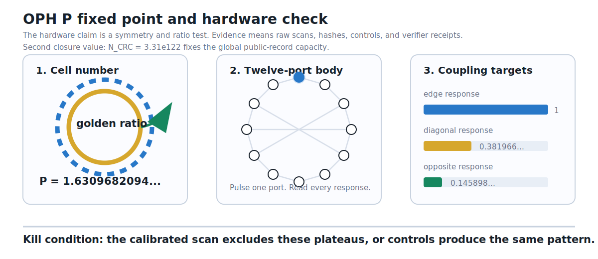

# OPH: Predictions, Differences, And Ways To Break It

## TL;DR

A simulation slogan alone is unfalsifiable. OPH becomes science where the
fixed-point story produces exact numbers and exact failure conditions.

The compact claim is simple:

> Reality is the observer-facing fixed point of a finite patch-consistency
> computation.

The sharp OPH claim has three parts.

1. The local pixel constant \(P_\star\) and the global screen capacity \(N_\star\)
   are unique closure fixed points.
2. The two fixed points resonate through the 24-tick repair lock.
3. The same two fixed points compress the source-certified outputs: hierarchy,
   dimensionless gravity, the SI display for Newton's constant, gauge branch,
   masses, neutrino targets, dark-sector rows, and hardware signatures.

The theory loses if the math fails, if a calculation reads the answer it claims
to predict, if \(P_\star\) or \(N_\star\) are not unique fixed points, if the 24-tick
lock fails, if the compact Newton-constant derivation fails, if the particle
numbers miss precision data, if hardware signatures fail blind replication, or
if a weak row is presented as a strong one.

Useful background:

- [OPH Textbooks](https://learn.floatingpragma.io/)
- [Reverse Engineering Reality](https://oph-book.floatingpragma.io/)
- [Compact proof of OPH](compact_proof_of_oph.pdf)

## Quick Dictionary

| Term | Plain meaning |
| --- | --- |
| Falsifiable | A real test can make the claim lose. |
| Observer patch | The part of reality one observer, device, or local system can access. |
| Overlap | The shared part two patches can both check. |
| Repair | The settling step when two shared descriptions disagree. |
| Fixed point | The stable answer after checking stops changing the result. |
| Branch | A claim that works under stated assumptions. |
| Benchmark check | A useful comparison with known data. Treat it as weaker than a fresh prediction. |
| Empirically anchored | The measured value helped set up the number. Do not sell it as a clean prediction. |
| First-principles check | The displayed value is emitted by the declared OPH source map or theorem certificate, without the target value in the calculation path. |
| Standard Model | The particle-physics rulebook for known particles and forces, except gravity. |
| Gauge group | The symmetry bookkeeping behind forces. Plainly: allowed relabeling inside the force description that leaves physics unchanged. |
| Hypercharge | A Standard Model charge label used to build electric charge. |
| Lorentzian spacetime | Spacetime with relativity built in. Light-speed structure is invariant. |
| Einstein branch | The OPH route that tries to recover general relativity. |
| Neutrino | A tiny weakly interacting particle. Its masses and mixing make good tests. |
| Proton decay | A hypothetical proton breakup. OPH forbids the usual grand-unified gauge-boson route. |
| Qubit | A quantum bit. It carries richer structure than a normal 0/1 bit before measurement. |
| Conditional mutual information | How much information two regions share after the middle region is known. |
| Quantum recovery | A test of whether a missing piece can be reconstructed from the middle piece. |
| \(P_\star\) | OPH's local pixel constant. It is the unique local closure value, not a fitted variable. |
| \(N_\star\) | OPH's global screen-capacity fixed point, about \(3.31\times10^{122}\) in the de Sitter capacity display. |
| 24-tick repair lock | One global screen step equals 24 rounds of local repair. The number is \(2(8+3+1)\), the reversible write/check spectrum of the Standard Model gauge algebra. |
| \(N_{\mathrm{CRC}}^{\mathrm{EW}}\) | The electroweak-refined capacity used in the hierarchy bridge, \(3.5323546226929906511\ldots\times10^{122}\). |
| \(G_{\mathrm{OPH}}\) | The OPH SI display for Newton's constant, \(6.674299995910528\ldots\times10^{-11}\,\mathrm{m^3\,kg^{-1}\,s^{-2}}\), with the stated QCD/clock caveat. |
| QCD-free witness | A test route that avoids hadronic payloads, so it cannot be accused of importing QCD estimates. |
| \(\chi_\nu\) | The coherent scalar susceptibility continuation used in the lift-response note. It has canonical and engineering charts. |
| Golden ratio | The number about \(1.618\) that appears in five-fold symmetry. |

## What OPH Claims

OPH starts from local observers and overlap checks. It asks how much familiar
physics follows from that agreement rule.

The claims fall into three buckets:

1. **Core reconstruction.** Relativity, an Einstein-gravity branch, compact
   force-symmetry reconstruction, and the Standard Model quotient selected by
   Minimal Admissible Realization (MAR), with hypercharges, three colors, and
   three generations.
2. **Two-constant numerical closure.** The local pixel fixed point \(P_\star\)
   and the global screen-capacity fixed point \(N_\star\) are forced fixed
   points. Their 24-tick resonance emits the QCD-free hierarchy witness,
   dimensionless gravity, the SI Newton display, and the source-certified
   number rows.
3. **Continuations and empirical branches.** Dark matter phenomenology,
   \(\chi_\nu\) lift response, hadrons, cognition, metaphysics, and proof-of-work
   hardware. These require their own assumptions, controls, and evidence
   bundles.

The compact proof focuses on the second bucket. The falsifiability map keeps
the third bucket visible so a failed continuation kills the right claim instead
of silently moving the goalposts.

## What Differs From Mainstream Physics

| Topic | Mainstream starting point | OPH move |
| --- | --- | --- |
| Spacetime | Geometry is basic in general relativity. | Geometry is recovered from observer-patch consistency. |
| Quantum theory | Fields and Hilbert spaces carry the theory. | Quantum algebra is the local record language of patches. |
| Standard Model | Force symmetry and matter content are inputs. | Combined zero obstruction (central or higher-associator strictification plus an allowed trivial-holonomy strict representative) is a fixed-stage transportability condition. On a cofinal tail carrying the compact-gauge refinement receipt, the tensor-generated sector colimit reconstructs some compact gauge group; Minimal Admissible Realization plus the explicit one-Higgs matter package selects the realized Standard Model force quotient, exact hypercharges, three colors, and three generations. |
| Constants | About 30 Standard-Model-plus-cosmology values are treated as independent measurements. | OPH compresses the displayed rows into two fixed points, \(P_\star\) and \(N_\star\), tied by the 24-tick lock. |
| Grand unification | Many extensions use one larger simple symmetry. | OPH uses a product-group structure. The usual leptoquark gauge bosons are absent. |
| Dark matter | Usually a cold invisible component. | OPH uses a repair/modular response branch. The implementation is before full statistical closure. |
| Hierarchy problem | The Higgs scale looks tuned against UV corrections. | The weak scale is a branch readout of the 24-tick repair lock with naturality defect \(\epsilon_H=0\). |
| Newton's constant | \(G\) is measured as an input constant. | OPH derives a dimensionless gravity relation and an SI display path for Newton's constant; the SI display carries the stated QCD/cesium-clock caveat. |
| Coding language | Code distance is fixed only after a concrete code is specified. | A bare OPH overlap net is only a finite constraint code; QECC distance and min-cut resilience require topological-code and error-model certificates. |
| Hardware | Digital search runs candidates one by one. | OPH hardware claims use measured candidate enrichment plus exact digital verification. Evidence requires public bundles. |

## Risky Predictions And Status

| Claim | OPH output | Status |
| --- | --- | --- |
| Standard Model quotient | the usual color, weak, and electromagnetic force structure with the six-fold identification | realized-branch theorem claim |
| Hypercharges | exact Standard Model rational charge lattice | realized-branch theorem claim |
| Color count | exactly three colors | realized-branch theorem claim |
| Generation count | exactly three matter generations | realized-branch theorem claim |
| Electromagnetic, color, and tensor carriers | \(k^2=0\) classical modes on the stated Maxwell, perturbative/deconfined Yang--Mills, and pure-Einstein branches | conditional action-level receipts; quantum-particle gates remain separate |
| Gauge-mediated proton decay | forbidden by the OPH product-group branch | clean experimental fork |
| Grand-unified leptoquark gauge bosons | absent | product-group consequence |
| Local pixel closure | \(P_\star=1.630968209403959324879279847782648941\ldots\) | unique fixed-point claim |
| Global screen closure | \(N_\star\simeq3.31\times10^{122}\) in the de Sitter screen-capacity display | unique fixed-point claim |
| Electroweak-refined capacity | \(N_{\mathrm{CRC}}^{\mathrm{EW}}=3.5323546226929906511\ldots\times10^{122}\) | hierarchy-bridge capacity |
| 24-tick repair lock | \(m_{\mathrm{rep}}=2(8+3+1)=24\) | parameter-free resonance claim |
| QCD-free hierarchy | \(v/E_\star=2.0199803239725553\times10^{-17}\) | source-certified hierarchy witness |
| Higgs naturality | \(\epsilon_H=0\) with interval \([0,0]\) | hierarchy-problem solution |
| Newton constant display | \(G_{\mathrm{OPH}}=6.674299995910528\ldots\times10^{-11}\,\mathrm{m^3\,kg^{-1}\,s^{-2}}\) | SI display with QCD/clock caveat |
| Fine structure | undressed source/root inverse coupling \(\alpha_{\mathrm{root}}^{-1}=136.994835\ldots\); combining it with \(\alpha_U(P_C)\) at the CODATA-derived comparison pixel gives the mixed-provenance diagnostic \(137.0359595008\ldots\); public Thomson endpoint \(137.035999177(21)\) | source-only endpoint requires the OPH-QCD spectral backend and no-target-leak certificate |
| Higgs | `125.1995304097179 GeV` | closed on the declared Higgs/top surface |
| Top coordinate | `172.35235532883115 GeV` | selected public quark-frame and cross-section codomain |
| Quarks | exact running sextet on the selected public frame | selected-frame theorem |
| Neutrino weighted-cycle point | atmospheric angle `49.7228` degrees and CP phase `305.581` degrees | rejected target-informed template comparison; NuFIT 6.1 gives Δχ² values `20.12` and `18.44`, above the two-parameter 3σ value `11.83` |
| Physical PMNS matrix | no emitted value | the shared-basis identity cancels the charged-lepton matrix by construction; the physical charged-lepton basis remains open |
| Absolute neutrino masses and sum | no emitted prediction | the displayed `0.01745`, `0.01948`, and `0.05308` electron-volt values are compare-only coordinates on the rejected candidate |
| Majorana phases | no emitted prediction | the displayed phase pair is a compare-only readout of the same rejected candidate |
| IBM five-state cyclic test | ratio near the golden-ratio square, about `2.618033988749895` | reduced-sector hardware signature |
| IBM six-state nonabelian test | ratio near `2` after clean layout accounting | reduced-sector hardware signature |
| Bench `P` body | icosahedral coupling plateaus with golden-ratio ratios | engineering evidence claim |
| Dark-sector cosmology | the checked-in `Omega_A = 0.264114401`, CAMB `Omega_m = 0.315905206`, `sigma8 = 0.807787204`, and `S8 = 0.828924037` rows are legacy pre-likelihood diagnostics; `rho_A/rho_b = 5.363470441` is the parent-grid input | the checked-in run used the rejected weighted-cycle neutrino mass sum and is invalidated as a current OPH number row; regenerate with an explicitly declared external neutrino scenario before scientific use |
| \(\chi_\nu\) lift response | \(\chi_\nu^{\mathrm{can}}=\exp(-P_\star/24)=0.9343006394893864\ldots\); for \(N_{\mathrm{coh}}=10^{22}\), \(9.34\times10^{-23}\le\chi_\nu^{\mathrm{eng}}\le10^{-22}\) | scoped continuation branch |
| Hadrons | no first-principles masses from the stated theorem | gated on a strong-binding construction |
| Hardware proof-of-work | candidate enrichment or verified shares | engineering evidence claim |
| QECC/min-cut resilience | no claim from a bare overlap graph; only certified topological-code branches may state distance/min-cut or Knill-Laflamme correction | certificate-gated extension |

Weaker rows:

- \(W\) and \(Z\) masses are benchmark checks.
- Charged leptons are empirically anchored witnesses.
- Direct top mass is a benchmark check outside the cross-section codomain.
- Strong CP is not emitted by the selected-frame quark theorem.
- Empirical hadron closure uses measured electron-positron to hadron input.
- The SI Newton display uses a cesium-clock branch where QCD/hadronic
  refinements are stated as a caveat. The QCD-free hierarchy witness is the
  cleaner compact-proof row.
- Hardware claims need raw evidence bundles, controls, and verifier records. The compute claim is a measured distributional lift \(B=p_Q/p_U\), not a complexity-class theorem.
- Bare overlap graphs do not determine code distance. Distance/min-cut and corrupted-observer correction claims need an explicit code subspace, logical operators, error family, and recovery certificate.

## The Two Fixed Points In Plain Language

The local pixel number is

\[
P_\star=1.630968209403959324879279847782648941\ldots.
\]

The golden-ratio base is:

\[
\varphi=1.618033988749894848204586834365638117\ldots.
\]

The gap is:

\[
P_\star-\varphi=0.012934220654064476674693013417010824\ldots.
\]

On the public endpoint branch, OPH ties that gap to electromagnetism:

\[
P_\star-\varphi=\frac{\sqrt{\pi}}{137.035999177}.
\]

Plainly: the pixel cannot remain exactly golden. The same cell has to read as a
geometric boundary object and as an electromagnetic field-width object. The
public endpoint detuning is the electromagnetic width read back by that same
cell after the empirical hadron closure is included.

The global capacity number is

\[
N_\star \simeq 3.31\times10^{122}.
\]

Plainly: the universe has to contain exactly the record capacity needed by the
screen that contains the universe. The capacity is selected by closed-screen
readback plus Minimal Admissible Realization (MAR).

The local and global numbers are locked together:

```text
m_rep = 2 * dim(su(3) + su(2) + u(1))
      = 2 * (8 + 3 + 1)
      = 24
```

One update of the world consists of 24 rounds of local repair. After those 24
rounds, local mismatch reduction lines up with one global screen step. That is
the OPH repair resonance between pixel and screen.

The QCD-free hierarchy witness is the cleanest numerical stress test:

\[
\frac{v}{E_\star}=2.0199803239725553\times10^{-17},
\qquad
\epsilon_H=0.
\]

This row does not use the public Thomson endpoint, hadron masses, the cesium
clock, \(G\), \(\Lambda\), \(W\), \(Z\), or the Higgs mass as ancestors. That is why it
is the compact proof's answer to the QCD-circularity criticism.

The fine-structure weakpoint is precise. The source-side trunk gives the undressed
source/root inverse coupling \(\alpha_{\mathrm{root}}^{-1}=136.9948351646\ldots\).
Combining it with \(\alpha_U(P_C)\), evaluated at the CODATA-derived comparison pixel,
gives the mixed-provenance diagnostic \(137.0359595008\ldots\). The public Thomson
endpoint \(137.035999177(21)\) requires the same-scheme QCD/hadronic
electromagnetic payload. The calibrated factor
\(C_{24,Q}=1.00096478597323262538\ldots\) is comparison bookkeeping, not that payload. The public
fine-structure endpoint is therefore tracked separately from the QCD-free
hierarchy witness.

The SI display for Newton's constant is:

\[
G_{\mathrm{OPH}}=6.674299995910528\ldots\times10^{-11}\,
\mathrm{m^3\,kg^{-1}\,s^{-2}}.
\]

This display uses the OPH scale certificate and the cesium-clock branch. Its
QCD/hadronic caveat is explicit. The dimensional gravity theorem and the
hierarchy witness are the cleaner first-principles checks.

Hardware does not measure a fundamental Planck cell. The bench version tests an
analogue: a self-reading twelve-port body. Pulse one port, read the other
ports, and group the responses by icosahedral symmetry. The target pattern is:

```text
edge response : diagonal response : opposite response
= 1 : 0.381966011250105... : 0.145898033750315...
```



## Sharp Numerical Tests

These tests are written as kill conditions. A successful attack does not have
to dislike OPH. It only has to satisfy the declared protocol and miss the
declared number.

### 1. \(\chi_\nu\) Lift Response

Canonical prediction:

\[
\chi_\nu^{\mathrm{can}}=\exp(-P_\star/24)=0.9343006394893864\ldots,
\qquad
0.9343006394893864\le\chi_\nu^{\mathrm{can}}\le1.
\]

Engineering chart:

\[
\chi_\nu^{\mathrm{eng}}=\frac{\chi_\nu^{\mathrm{can}}}{N_{\mathrm{coh}}}.
\]

For \(N_{\mathrm{coh}}=10^{22}\):

\[
9.34\times10^{-23}\le\chi_\nu^{\mathrm{eng}}\le1.00\times10^{-22}.
\]

Hoverboard-class areal load:

\[
\Sigma=200\text{ to }600\,\mathrm{kg\,m^{-2}},
\qquad
\Delta S_{\mathrm{coh}}^{\mathrm{can}}\simeq2\times10^{-8}\text{ to }6\times10^{-8}
\]
for full response.

Test:

1. Build a substrate that produces and logs the declared vertical canonical
   coherence contrast.
2. Measure vertical force with \(A_\perp\), \(\Sigma\), \(\Delta S_{\mathrm{coh}}\), temperature,
   acoustic drive, EM pickup, and mechanical coupling recorded in the same
   evidence bundle.
3. Use a blind pass/fail threshold before the lift run.

Null bound:

\[
|\chi_\nu^{\mathrm{eng}}|
\le
\frac{4\pi G F_{\min}}{g^2 A_\perp|\Delta S_{\mathrm{coh}}^{\mathrm{eng}}|}.
\]

Falsification:

```text
"hoverboard doesn't work"
```

Meaning: the substrate reaches the declared contrast, the control channels stay
null, and the predicted force fraction is absent.

### 2. Dark-Sector Cosmology

OPH fixes:

```text
Omega_A = 0.264114401
Omega_m^CAMB = 0.315905206
sigma8 = 0.807787204
S8 = 0.828924037
rho_A / rho_b = 5.363470441
```

Test:

1. Run the public scorecard:

   ```text
   python3 code/dark_matter/scripts/dark_empirical_scorecard.py --quiet
   ```

2. Replace the compact CAMB/SPARC scaffolds by the full covariance likelihoods
   named in the dark-sector paper.
3. Compare CMB, BAO, SPARC, cluster, and weak-lensing data without refitting
   the OPH branch numbers.

Falsification:

The fixed branch fails the joint likelihood under the declared kernel.

### 3. Rejected Neutrino Comparison

The weighted-cycle template produced the frozen comparison point:

```text
sin^2(theta23) = 0.5820560367
delta_CP = -54.419 degrees
Delta m21^2 / Delta m32^2 = 0.0307211101
```

NuFIT 6.1 gives correlated profile values `20.12` with the tabulated
atmospheric likelihood and `18.44` without it. Both exceed the two-parameter
3σ value `11.83`, so this candidate is rejected.

The shared-basis calculation defines the neutrino matrix using the supplied
charged-lepton matrix and then cancels that matrix when it reconstructs the
weighted-cycle unitary. It checks an algebraic representation identity and
does not derive the physical charged-lepton basis. The lane therefore emits no
physical PMNS matrix, absolute masses, mass sum, or Majorana prediction.

This rejection does not falsify the finite OPH core. A neutrino falsification
test requires a source-derived family kernel, cycle law, orientation, and
physical charged-lepton basis, frozen before the comparison data are opened.

Falsification applies if such a source-closed branch is later excluded under
its preregistered likelihood test.

### 4. Electroweak, Higgs, And Top Coordinates

OPH gives:

```text
M_W = 80.377 GeV
M_Z = 91.18797809193725 GeV
m_H = 125.1995304097179 GeV
m_t = 172.35235532883115 GeV
```

Test:

Use scheme-controlled `W/Z/H` measurements, lepton-collider Higgs programs, and
top-threshold or cross-section mass determinations in the declared schemes.

Falsification:

Precision measurements land outside these fixed coordinates after scheme
conversion is locked before comparison.

## Frozen IBM Quantum Cloud Engineering Archive

The former IBM quantum-cloud test program is frozen. Its circuits are useful
engineering demonstrations with public controls, but standard quantum
mechanics predicts every programmed target. Success or failure can validate or
break a preparation, readout, analysis, or feedback implementation; it cannot
discriminate OPH from quantum mechanics.

More shots, chips, or blinding do not repair the missing model contrast. The
program may reopen only after OPH supplies a source-closed observable with a
different numerical QM prediction, an effect size, an identifiable noise
model, an audit against existing constraints, and a preregistered decision
rule. The following software, evidence checklist, and experiment recipes are
retained only to document the frozen archive.

Minimum software stack:

1. Python.
2. Qiskit.
3. Qiskit Aer local backend.
4. IBM Quantum Runtime access.
5. NumPy and SciPy for the analysis.

Minimum evidence bundle:

1. IBM job IDs.
2. Backend name and calibration snapshot.
3. Circuit definitions or circuit hashes.
4. Physical qubit layout.
5. Shot count.
6. Raw counts.
7. Readout-calibration counts.
8. Simulator output.
9. Bootstrap confidence intervals.
10. Blind-analysis notes.

### Archived IBM Engineering Experiments (Frozen)

The “failure outcomes” below concern only the corresponding implementation.
They are not OPH falsifiers and are not an invitation to fund another hardware
campaign without first passing the discriminator gate above.

#### 1. Recovery Fingerprint

Run three-qubit circuits.

States:

1. A structured low-overlap state.
2. Two nearby structured states with higher overlap.
3. A GHZ control.
4. A random-depth control.

Measurement:

1. Use all 27 Pauli tomography bases: each qubit measured in X, Y, or Z.
2. Use at least 512 shots per basis. More shots make the test sharper.
3. Reconstruct the three-qubit density matrix.
4. Compute conditional mutual information.
5. Compute quantum-recovery fidelity and trace distance.

Engineering failure outcome:

The structured low-overlap states fail to recover better than GHZ and random
controls on two calibrated chips, or recovery fails to improve as conditional
mutual information drops.

Why:

This would remove the advertised overlap-recovery behavior from this prepared-
state implementation. It would not distinguish OPH from QM.

#### 2. Three-State Sanity Test

Run a two-qubit circuit that encodes three logical states. Use diffusion times:

```text
0.3, 0.6, 0.9
```

The expected heat-flow eigenvalues are:

```text
0, 3, 3
```

Measurement:

1. Read the three physical probabilities.
2. Let `p0`, `p1`, and `p2` be those probabilities.
3. Compute two time estimates:

```text
t1 = -log(p1 / p0) / 3
t2 = -log(p2 / p0) / 3
```

Engineering failure outcome:

The two time estimates disagree outside the pre-fixed error window on clean
hardware while the local backend, leakage, and readout calibration pass.

Why:

This breaks the encoded heat-flow sanity check. It diagnoses the circuit or
readout path, not a difference between OPH and QM.

#### 3. Five-State Golden-Ratio Test

Run a three-qubit circuit that encodes five logical states. Use diffusion
times:

```text
0.3, 0.6, 0.9
```

The target ratio is:

```text
2.618033988749895
```

Measurement:

1. Read five physical probabilities.
2. Let `p0` be the zero-mode probability.
3. Average the two first-gap probabilities into `p1`.
4. Average the two second-gap probabilities into `p2`.
5. Compute:

```text
delta1 = -log(p1 / p0)
delta2 = -log(p2 / p0)
ratio = delta2 / delta1
```

Engineering failure outcome:

High-shot runs on clean layouts and two chips exclude `2.618033988749895` with
the pre-fixed confidence interval, while the three-state sanity test passes.

Why:

This removes the advertised ratio from this prepared-state implementation. QM
still predicts the ideal target circuit.

#### 4. High-Shot Five-State Retest

Run the five-state test at diffusion time:

```text
0.9
```

Use a larger shot budget, for example:

```text
32768 shots
```

Measurement:

Use the same ratio estimator as the five-state golden-ratio test.

Engineering failure outcome:

The high-shot confidence interval excludes `2.618033988749895` after
calibration and blind analysis.

Why:

The public bundle already has a high-shot reading near `2.5498`, whose interval
is below the target. That is a useful hardware diagnostic, not an OPH
falsification.

#### 5. Six-State Nonabelian Layout Test

Run a two-qubit circuit with three physical sectors:

1. trivial sector
2. sign sector
3. standard sector

Use diffusion time:

```text
0.6
```

Use at least:

```text
8192 shots
```

Readout calibration:

1. Prepare and measure all four computational basis states.
2. Build the assignment matrix.
3. Apply the same mitigation rule before reading the final ratio.

Measurement:

1. Compute the decay gap for the sign sector.
2. Compute the decay gap for the standard sector.
3. Compute:

```text
ratio = sign gap / standard gap
```

The target is:

```text
2
```

Engineering failure outcome:

No clean layout lands near `2`, or the target appears only after choosing the
layout with knowledge of the target.

Why:

This diagnoses failure or layout sensitivity in the six-state implementation.
It does not select between OPH and QM.

#### 6. Blind Relabeling Test

Run the five-state and six-state tests under random hidden label permutations.
The person running the analysis should not know which permutation is
OPH-favored until the metrics are emitted.

Measurement:

1. Record the hit rate for the OPH-favored labeling.
2. Record the hit rate for random labelings.
3. Compare the two hit rates using the same target intervals.

Engineering failure outcome:

Random label orders hit the target as often as the OPH-favored order.

Why:

This would expose a labeling artifact in the implementation analysis.

#### 7. Decoy-Spectrum Test

Run circuits with the same qubit count, shot count, and noise exposure, using
unrelated cyclic or random spectra.

Measurement:

Use the same ratio estimators as the OPH tests.

Engineering failure outcome:

Decoys produce target hits as often as the OPH circuits.

Why:

This removes controller-level specificity. Even successful specificity against
these decoys would not create OPH-versus-QM specificity.

### Archived IBM Bundle Readings

| Reading | Bundle value |
| --- | --- |
| Recovery, chip 1 | structured low-overlap CMI `0.2309`, GHZ `0.9474`, random `0.3890`; fingerprint checks pass |
| Recovery, chip 2 | structured low-overlap CMI `0.1498`, GHZ `0.9166`, random `0.4992`; fingerprint checks pass |
| Three-state sanity | independent time readouts agree at the tested diffusion times |
| Five-state cyclic test | representative ratios `2.5974`, `2.7383`, and `2.5786`; target `2.6180` |
| High-shot five-state stress point | ratio `2.5498`, below target |
| Six-state nonabelian layout test | one layout gives about `1.872`; reversed layout gives about `2.030`; target `2` |

### Former IBM Disproof Rule (Withdrawn)

No result from the present circuit family counts as an OPH-versus-QM disproof
or confirmation, because the two descriptions do not make different
predictions for these interventions. The former calibration, leakage,
two-system, and public-count requirements remain good engineering practice,
but they cannot substitute for a numerical theory discriminator.

## Falsification Ladder

This ladder contains hard OPH-killing tests. The frozen IBM archive above is
excluded from the ladder; it tests only its engineered implementations.

Difficulty:

1. Reproducible computation or small theorem.
2. Full theorem or construction.
3. Precision lab result.
4. Particle, cosmology, or astrophysics result.
5. Facility-scale or high-confidence discovery.

### Theory And Computation

| Test | Outcome that kills OPH | Why it kills OPH |
| --- | --- | --- |
| Repair confluence | A finite observer-patch network satisfies the OPH descent assumptions, and two accepted repair orders from the same initial quotient state settle into different observer-facing quotient normal forms with no declared holonomy or higher-gauge obstruction. | Descent only proves termination. OPH needs the local-diamond condition plus repair completeness for confluence. Same-boundary uniqueness also needs a preserved boundary/sector map with a unique consistent extension. If the final physical answer depends on repair order under those hypotheses, the proposed repair law fails as an OPH consensus mechanism. |
| Mismatch descent | A repair move accepted by the OPH rules makes the mismatch larger and no compensating potential decreases. | Repair is supposed to settle disagreements. If an allowed move can make the system less consistent, the core dynamics points the wrong way. |
| Relativity emergence | A model satisfies the controlled BW branch certificate, cap-pair extraction, regularized modular transport, support-readable modular covariance, round-cap rigidity, and KMS/BW normalization, then fails to produce the Lorentzian cap/conformal light-cone structure. | OPH claims Lorentz kinematics on the controlled geometric cap-pair branch. A countermodel satisfying that certificate while lacking the Lorentzian light-cone structure breaks the branch. |
| Einstein branch | The entropy and modular assumptions hold, the controlled Markov-collar and controlled modular remainders vanish in the stated limits, and the Einstein-gravity limit fails. | OPH claims ordinary gravity appears as a controlled scaling branch of the overlap rules. If the stated assumptions and vanishing carried remainders do not give that branch, the gravity reconstruction fails. |
| Gauge reconstruction | A cofinal tail satisfies the full compact-gauge refinement receipt, yet the zero-obstruction construction fails to produce a well-defined compact group from the stated tensor-generated transportable sector category and forgetful fiber. | This breaks the receipt-conditional classification/reconstruction stage before any Standard Model selection claim can be made. Without the receipt, no refinement-limit group is claimed. |
| MAR selection | A valid MAR-admissible one-Higgs low-energy sector package, satisfying the same anomaly, refinement, CP, and weak-sector clauses, is selected instead of the Standard Model package. | OPH does not claim cocycles alone force the Standard Model. The selection claim is MAR-local; a different MAR-minimal package would mean the theory did not derive the realized Standard Model branch. |
| Charge lattice | The stated assumptions allow a different hypercharge lattice. | Hypercharge fixes electric charges. If OPH allows another lattice, the observed charge pattern was not forced by the theory. |
| Generation count | A valid OPH construction has two or four light matter generations. | OPH claims exactly three generations. A valid two-generation or four-generation world breaks that count. |
| Fermions and chirality | Chiral fermions have to be imported from the Standard Model by hand. | OPH says matter structure follows from observer consistency. If the key fermion structure has to be assumed, the reconstruction fails. |
| Local pixel fixed point | The stated \(P_\star\) fixed-point equations have no unique solution at \(1.630968209403959324879279847782648941\ldots\), or the source map reads the low-energy target value. | The local pixel closure is one of the two OPH constants. If it is not unique or it cheats, the numerical compression fails. |
| Global screen fixed point | Closed-screen counting plus MAR does not select the displayed \(N_\star\) capacity branch, or the same equations allow incompatible capacity branches. | The horizon-capacity closure is the second OPH constant. If it is not forced, the two-constant claim fails. |
| 24-tick repair lock | The observer-visible product-adjoint repair spectrum is not \(2(8+3+1)=24\), or the local repair contraction fails to line up with the global screen step. | The repair resonance is the bridge between \(P_\star\) and \(N_\star\). If it fails, the hierarchy solution and compact compression claim lose their main mechanism. |
| QCD-free hierarchy witness | The declared first-principles hierarchy map imports \(G\), \(\Lambda\), \(W\), \(Z\), Higgs, low-energy Thomson, cesium-clock, or hadronic inputs, or it misses \(v/E_\star=2.0199803239725553\times10^{-17}\). | This is the compact proof's cleanest numerical result because it avoids QCD and clock assumptions. A miss kills the hierarchy-closure claim. |
| Newton constant display | The dimensionless gravity theorem fails, or the SI Newton display cannot be obtained after the declared scale certificate and caveated cesium-clock bridge are supplied. | OPH claims Newton coupling is a branch readout, not a fitted physical constant. The SI display is allowed to carry the stated QCD caveat; hiding that caveat would also be a failure. |
| Low-energy uniqueness | The OPH axioms plus MAR allow many inequivalent low-energy physics worlds with the same admissibility predicates. | OPH claims the familiar world is selected by MAR on the admissible class. If many incompatible worlds pass the same rules, the selection claim fails. |

### Particle And Precision Physics

| Test | Outcome that kills OPH | Why it kills OPH |
| --- | --- | --- |
| Maxwell carrier | With the Maxwell kinetic term, ordinary Lorentz vacuum, and no Higgs, Stückelberg, or medium mass all fixed, the reduced quadratic theory lacks its two transverse \(k^2=0\) modes. | This falsifies the scoped classical Maxwell carrier theorem. A photon-particle mass test applies only after a physical-Hilbert-space and positive-residue pole receipt is also supplied. |
| Color carrier | With the pure Yang--Mills kinetic term about the trivial flat connection and the perturbative/deconfined phase fixed, the reduced quadratic theory lacks its \(2\dim G\) transverse \(k^2=0\) modes. | This falsifies the scoped quadratic Yang--Mills theorem. Confinement can remove a free physical gluon pole and is not a counterexample to that theorem. |
| Einstein tensor carrier | With the pure two-derivative Einstein--Hilbert action, flat vacuum, and no extra fields or higher-curvature terms fixed, the reduced quadratic theory lacks its two transverse-traceless null modes. | This falsifies the scoped Einstein linearization theorem. A graviton-particle mass test applies only after quantization and a positive-residue physical pole have been established. |
| Fourth light generation | A fourth light chiral matter generation is discovered. | OPH claims the realized branch has exactly three generations. A fourth light generation breaks that branch. |
| Color count | A real fourth QCD color degree of freedom is found. | OPH fixes the color count at three. More colors mean the recovered strong-force sector has the wrong size. |
| Hypercharge outlier | A real elementary particle has charges outside the OPH hypercharge lattice. | OPH claims the Standard Model charge lattice is forced. One real outlier breaks the charge reconstruction. |
| Fractional color singlet | A stable color-singlet particle has fractional electric charge. | OPH inherits the Standard Model charge-quantization pattern for observable singlets. A stable fractional singlet breaks that pattern. |
| Grand-unified leptoquark bosons | Simple-grand-unified leptoquark gauge bosons are discovered. | OPH uses a product-group force structure. Those bosons belong to a larger simple force and are absent in the OPH branch. |
| Gauge-mediated proton decay | A proton decay channel mediated by simple-grand-unified gauge bosons is observed. | The proton cannot decay that way in OPH because the required leptoquark gauge bosons are not present. |
| Extra Higgs sector | Additional light Higgs multiplets are discovered in the minimal OPH regime. | OPH uses the observed one-Higgs structure on its minimal branch. Extra light Higgs multiplets break that branch. |
| Low-energy supersymmetry | A low-energy superpartner spectrum is discovered. | OPH's declared Standard Model branch does not contain that superpartner spectrum. Finding it means the branch is missing real particles. |
| Higgs naturality defect | The selected source-to-Higgs normal form has a nonzero RG/coarse-graining defect instead of \(\epsilon_H=0\). | OPH says the hierarchy problem collapses because the weak scale is emitted by the repair lock. A nonzero defect restores the fine-tuning problem. |
| Higgs and top numbers | Scheme-controlled measurements exclude the declared Higgs and top rows. | These rows are sharp number outputs. If precision data exclude them in the declared scheme, OPH missed a key mass relation. |
| Quark running masses | Scheme-controlled data exclude the declared quark running sextet. | OPH claims a selected quark frame. If the full sextet is excluded, the quark reconstruction fails. |
| Fine structure | A scheme-clean evaluation excludes the OPH fine-structure fixed-point value. | OPH ties the electromagnetic coupling to \(P\). If the coupling misses, the fixed-point number row fails. |

### Neutrinos

| Test or gate | Current result | OPH implication |
| --- | --- | --- |
| Weighted-cycle comparison point | The official NuFIT 6.1 correlated profile already rejects the target-informed point at the declared gate. | This retracts that candidate. It does not falsify the finite OPH core because the family kernel, basis placement, and mass labels were not source-derived or frozen before comparison. |
| Legacy mass tuple, sum, beta endpoint, splittings, and Majorana region | The displayed `0.01745`, `0.01948`, and `0.05308` electron-volt tuple, `0.0900119296` electron-volt sum, and its descendants are coordinates on the rejected candidate. | Agreement or disagreement with those coordinates is diagnostic only. They are neither OPH predictions nor OPH kill tests. |
| Physical neutrino construction | No source-closed neutrino operator, stable charged-lepton basis, physical mass-label rule, or pre-reference hash is emitted. | Physical PMNS, ordering, absolute masses, and Majorana phases remain unformed. No present neutrino number can be promoted. |
| Prospective neutrino falsification | First derive and hash-lock the missing source objects without oscillation-target feedback, then evaluate a likelihood whose data were not used in construction. | Exclusion of that preregistered source-closed branch would falsify the corresponding OPH neutrino claim. |

### Cosmology And Gravity

| Test | Outcome that kills OPH | Why it kills OPH |
| --- | --- | --- |
| de Sitter capacity | Cosmological data break the claimed de Sitter capacity relation. | OPH uses screen capacity as part of its spacetime bookkeeping. If the capacity relation fails, the screen picture fails. |
| Galaxy rotation law | Full galaxy-rotation data reject the OPH dark response law. | OPH's dark branch treats galaxy discrepancies as a repair/modular response. If the galaxy law is wrong, that branch fails. |
| Cluster lensing | Merger lensing, gas maps, and age covariance reject the OPH offset branch. | Galaxy clusters test whether the dark response tracks the right material. The wrong offset pattern breaks the branch. |
| Microwave background and growth | A full cosmology implementation fails microwave-background, acoustic-scale, growth, and clustering tests. | OPH has to fit the early universe and structure growth, beyond galaxy curves. A full cosmology miss destroys the dark-sector branch. |
| Dark-sector quantitative branch | After replacing the rejected weighted-cycle neutrino default with a declared external neutrino scenario and closing the parent receipts, a frozen joint CMB, BAO, SPARC, cluster, and weak-lensing run rejects the branch. | The checked-in fixed decimals are legacy pre-likelihood diagnostics and are not current kill values. A later source-eligible, preregistered joint branch would be falsifiable. |
| \(\chi_\nu\) lift response | A substrate reaches the declared vertical coherence contrast, control channels stay null, and the predicted force fraction is absent. | This is the scoped "hoverboard doesn't work" falsifier for the \(\chi_\nu\) continuation. It kills the lift-response continuation, not the recovered SM/GR core by itself. |
| Dark particle abundance | A stable particle is found that explains the dark abundance in conflict with the OPH dark branch. | OPH's dark branch is not the usual cold-particle story. A confirmed incompatible particle explanation removes that branch. |
| Black-hole entropy | Black-hole entropy data contradict the OPH screen-counting rule. | OPH treats screens and records as physical bookkeeping. Wrong black-hole entropy breaks that bookkeeping. |
| Page curve | Quantum black-hole information data contradict the OPH record claim. | OPH says records and overlap consistency control what can be recovered. A wrong Page-curve pattern breaks that claim. |
| Lorentz violation | High-confidence low-energy Lorentz violation is measured where OPH requires Lorentz symmetry. | OPH recovers ordinary relativistic structure. A real low-energy violation means the recovered spacetime branch is wrong. |
| Equivalence principle | High-confidence equivalence-principle violation is measured in the OPH Einstein regime. | OPH's Einstein branch uses ordinary general-relativistic universality. A real violation breaks that gravity branch. |

## Best Short List

If someone wants the fastest attack plan:

1. Break uniqueness of \(P_\star\) or \(N_\star\).
2. Break the 24-tick repair lock or the QCD-free hierarchy witness.
3. Break the dimensionless gravity theorem or the caveated SI Newton display.
4. Look for gauge-mediated proton decay.
5. Break one of the fully specified Maxwell, perturbative/deconfined Yang--Mills,
   or pure-Einstein classical carrier receipts; where a quantum-particle receipt
   has also been supplied, test its claimed physical pole and spectral mass.
6. Discover a fourth light matter generation or a charge-lattice outlier.
7. Demand a source-closed, preregistered neutrino operator, basis, and mass-label
   law, then try to exclude it. The existing weighted-cycle tuple is already a
   rejected comparison and is not an OPH kill test.
8. Exclude the Higgs, top, quark, or fine-structure number rows.
9. Build a repair-order counterexample.
10. Build a valid OPH countermodel with no relativistic light cone.
11. Reject the dark-sector branch with full cosmology and galaxy data.
12. Run the \(\chi_\nu\) lift-response test. If the calibrated substrate reaches
    the declared contrast and "hoverboard doesn't work", that continuation
    loses.
13. Use the IBM cloud tests to kill the reduced-sector hardware claim.

## Bottom Line

OPH has scientific bite where it gives exact failure conditions. Treat the
fixed-point simulation language as the architecture claim. Treat the closure
equations, theorem certificates, number rows, IBM tests, \(\chi_\nu\) protocol, and
hardware evidence bundles as the test surface.
