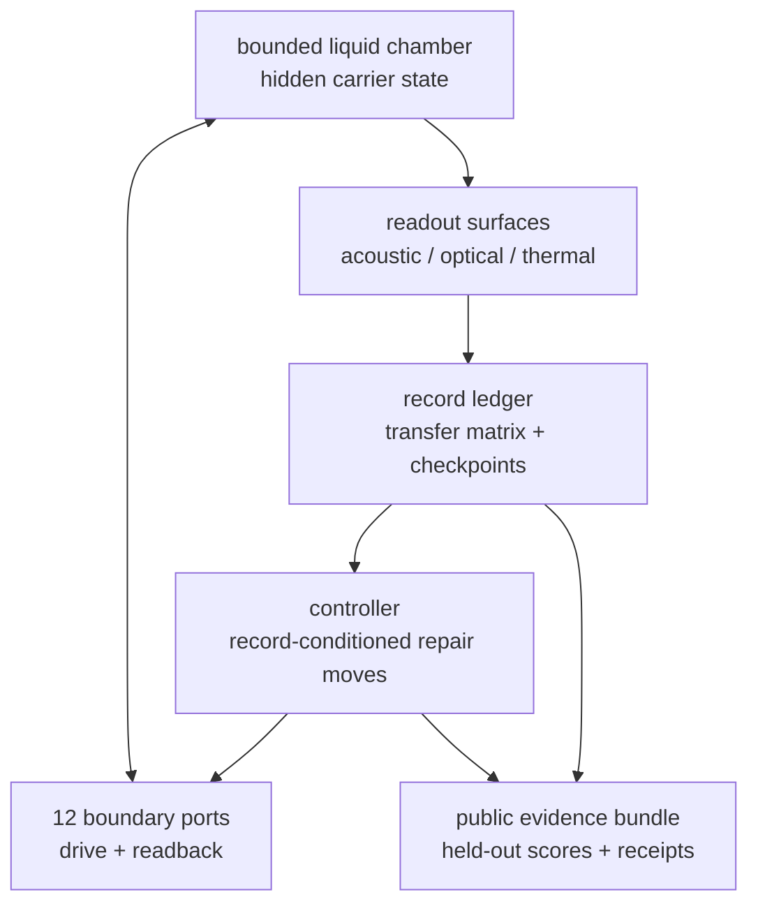

# Plasma Fusion and Confinement

## Motivating Result

This note entered the queue after the National Ignition Facility's December 5,
2022 ignition shot: 2.05 MJ of laser energy delivered to the target and 3.15 MJ
of fusion energy out
([NIF, "Achieving Fusion Ignition"](https://lasers.llnl.gov/science/achieving-fusion-ignition)).
That laboratory result made the old phrase "fusion solved" too blunt. The OPH
question is which receipt actually closed: fusion products at the target, heat
capture, delivered electrical load, or net plant output.

**Status:** solved as an OPH repair-ledger theorem package. Standalone markdown
supplemental writeup for public reading and OPH Sage ingestion.

## Introduction

Fusion is hard in legacy language because reaction products, core confinement,
edge stability, heat exhaust, ash removal, wall damage, tritium breeding, and
plant power all live on different ledgers. The problem statement is to keep a
hot plasma record alive under those constraints and to separate fusion products,
captured heat, delivered load power, and net plant output. In OPH the reactor is
a boundary-repair ledger: H-mode is the contracting edge-collar branch, ELMs are
obstruction/reset cycles, Lawson is one energy projection, and reactor relevance
requires a matched-controller score plus a closed plant ledger.

## Why Legacy Physics Gets Stuck

Legacy fusion physics has accurate local models for many pieces: cross
sections, magnetohydrodynamic stability, kinetic turbulence, confinement
scalings, edge physics, neutral transport, wall loading, tritium breeding, and
plant engineering. The reactor claim gets stuck because those pieces live on
different ledgers. A device can produce fusion products without capturing useful
heat. A target can reach a high gain relative to target input while the facility
ledger remains energy-negative. A plasma can improve confinement while creating
edge bursts, divertor overload, ash accumulation, or wall damage. A small
desktop device can produce a detector event while failing calorimetry, load
delivery, or whole-system accounting.

That makes “fusion solved” ambiguous in legacy language. Lawson and triple
product are real gates, but they are scalar projections of a larger boundary
and plant problem. Product evidence, captured heat, electricity, net plant
output, and useful availability are different claims. Without a single typed
ledger that keeps those tiers separate, a partial success can be promoted into a
reactor story before the missing receipt is visible.

In that framing, the reactor target is underdetermined: a scalar or detector
gate can pass while the plant claim fails.

## Why OPH Makes It Solvable

OPH makes the reactor a boundary-repair ledger. The state includes the plasma or
carrier, actuator state, diagnostics, wall state, hard constraints, mismatch
residuals, repair/control moves, and claim gates. Gauge labels, mesh labels,
diagnostic order, port labels, hidden carrier coordinates, worker IDs, and
scheduler metadata are quotiented away when they do not change the physical
record.

The OPH-specific solvable object is a typed promotion ladder. H-mode is treated
as an edge-collar contraction. ELMs are obstruction/reset cycles. Lawson is the
scalar energy-record projection. Loss-channel closure, matched-controller
comparison, and plant accounting decide reactor relevance. Desktop branches
such as the twelve-port acoustic carrier can promote only the tier they
actually receipt: carrier/control, DD products, captured heat, delivered load
power, or net plant output. OPH is unique here because it forbids promotion
across missing ledgers. A carrier receipt stops at carrier/control status. DD
products stop at product status. Heat, delivered power, and net plant output
each require their own ledger.

## Abstract

Fusion confinement is a boundary-repair ledger. The ledger keeps plasma state,
actuators, diagnostics, wall state, hard constraints, residuals, repair/control
moves, and claim gates in one typed record. H-mode is the edge-collar
contraction branch. ELMs are obstruction/reset cycles. Lawson is the scalar
energy projection. DD products, heat, delivered power, and net plant power live
in separate receipt tiers.

## External Benchmarks and Plant Gate

Fusion products alone do not define a reactor. The receipt ladder is

```math
\text{fusion products}
\to
\text{fusion heat}
\to
\text{captured heat}
\to
\text{electricity}
\to
\text{net plant output}
\to
\text{useful availability}.
```

ITER's public design target is plasma gain $Q\ge10$: about
$500\,\mathrm{MW}$ fusion power from $50\,\mathrm{MW}$ of plasma heating
for $400$ to $600$ second pulses. That is a plasma gate. Electricity
generation and whole-plant gain occupy separate gates.

NIF's repeated ignition results are target-level inertial-confinement gates.
The April 2025 LLNL report gives $2.08\,\mathrm{MJ}$ delivered to the target
and $8.6\,\mathrm{MJ}$ fusion yield, a target gain of $4.13$. The
whole-facility and grid-power ledgers remain separate from that target gate.

For a plant claim, OPH uses the plant ledger

```math
L_{\rm plant}
=
E_{\rm grid}
-
\left(
E_{\rm all\ inputs}
+\Delta E_{\rm stored}
+E_{\rm startup}
+E_{\rm shutdown}
+E_{\rm aux}
+E_{\rm consumables}
+E_{\rm maintenance}
+E_{\rm waste}
\right).
```

The net-plant promotion condition is

```math
L_{\rm plant}>5u_L.
```

The OPH contribution in this problem is a confinement and accounting layer:
magnetic-confinement boundary repair, edge control, loss-channel closure, and
plant-gate bookkeeping.

## Definition 1: OPH Fusion Repair Ledger

Fix a regulator $r$. An OPH Fusion Repair Ledger is the tuple

```math
\mathfrak L^{\rm fus}_r
=
\left(
Q_r,
V_r,E_r,
\{S_{i,r}\},
\{I_{e,r},\pi_{i,e,r}\},
\mathcal R^{\rm hot}_r,
\mathcal P_r,
\mathcal H_r,
\mathcal U_r,
\Phi^{\rm fus}_r,
T^{\rm BR}_r,
\mathsf{Gate}_r
\right).
```

The physical quotient state space is

```math
Q_r=\Sigma_r/\Gamma_r.
```

$\Sigma_r$ is the presentation space of plasma, actuator, diagnostic, wall,
control, and evidence records. $\Gamma_r$ removes gauge labels, mesh labels,
diagnostic channel order, port labels, hidden carrier coordinates, worker IDs,
scheduler metadata, and any label not declared physical.

For a tokamak branch,

```math
V_{\rm tok}
=
\{C,P,E,SOL,D,W,M,H,F,X,G\},
```

where $C$ is core, $P$ pedestal, $E$ edge collar, $SOL$ scrape-off
layer, $D$ divertor, $W$ wall, $M$ magnetic system, $H$ heating/current
drive, $F$ fueling/pumping, $X$ diagnostics, and $G$ controller.

For a twelve-port acoustic carrier branch,

```math
V_H=
\{\mathrm{chamber},\mathrm{fluid},P_1,\ldots,P_{12},
\mathrm{controller},\mathrm{optical},\mathrm{acoustic},
\mathrm{thermal},\mathrm{radiation},\mathrm{load}\}.
```

Each $S_{i,r}$ is a local patch state. For a magnetized plasma,

```math
s_i=
(n_e,n_i,T_e,T_i,p,j,q,\mathbf B,E_r,\mathbf v,
Z_{\rm eff},n_0,n_{\rm ash},f_\alpha,\mathcal T_{\rm turb},\ldots)_i.
```

For an acoustic carrier,

```math
s_i=
(H_{ij},x_{\rm readback},z_{\rm collapse},T_{\rm fluid},
p_{\rm acoustic},R_{\rm records},A_{\rm artifact},u_{\rm drive},\ldots)_i.
```

The interface maps

```math
\pi_{i,e}:S_i\to I_e
```

expose boundary-visible data: heat flux, particle flux, current flux, radiation,
neutral flux, turbulence spectrum, pedestal gradient, acoustic transfer matrix,
optical flash timing, detector counts, calorimeter output, load output, and
receipt state.

The hot record is

```math
\mathcal R^{\rm hot}_r
=
(W,\bar n,\bar T_i,\bar T_e,Y_{\rm fus},\tau_E,
\Pi_{\rm stab},\Pi_{\rm exhaust},\Pi_{\rm wall}).
```

The physical source/loss ledger is

```math
\mathcal P_r(q)
=
(P_{\rm aux},P_{\rm ch},P_{\rm loss},W,\tau_E,Y_{\rm fus}).
```

The hard constraints are

```math
\mathcal H_r=
\{
q_{\rm div}\le q_{\rm div}^{\max},
\ s_{\rm ped}<1,
\ Z_{\rm eff}\le Z_{\rm eff}^{\max},
\ f_{\rm ash}\le f_{\rm ash}^{\max},
\ D_{\rm mat}\le D_{\rm mat}^{\max},
\ \text{tier receipts closed}
\}.
```

$\mathcal U_r$ is the declared repair/control menu: heating, current drive,
shaping, fueling, pumping, impurity seeding, divertor control, resonant magnetic
perturbations, pellet pacing, feedback control, acoustic multi-port drive,
checkpoint restore, or another declared control move.

The scalar mismatch functional is $\Phi^{\rm fus}_r$. The boundary-repair
operator is $T^{\rm BR}_r$. The claim gate $\mathsf{Gate}_r$ records the
claim tier: mathematical, carrier, control, DD product, DD heat, delivered
power, or net plant.

## Fusion Mismatch Functional

Define

```math
\Phi^{\rm fus}_r(q)
=
\|\mathbf r(q)\|_W^2
+
\iota_{\mathcal H_r}(q)
+
\iota_{\mathsf{Gate}_r}(q).
```

$\mathbf r(q)$ is a vector of dimensionless residuals. $W\succ0$ is a
weight matrix fixed before comparison. $\iota_{\mathcal H_r}$ is zero when
hard physical constraints pass and $+\infty$ otherwise.
$\iota_{\mathsf{Gate}_r}$ is zero only when the evidence receipts for the
claimed tier are present.

A concrete residual vector is

```math
\mathbf r=
(
r_{\rm bal},
r_W,
r_\tau,
r_Y,
r_\chi,
r_{\nabla p},
r_{\rm shear},
r_{\rm PB},
r_{\rm KBM},
r_j,
r_q,
r_{\rm ash},
r_Z,
r_{\rm rad},
r_{\rm wall},
r_{\rm unclass}
).
```

The energy-balance residual is

```math
r_{\rm bal}
=
\left[
\frac{P_{\rm loss}-P_{\rm aux}-P_{\rm ch}}{P_0}
\right]_+.
```

The record residuals are

```math
r_W=
\left[
\frac{W_{\rm req}-W}{W_{\rm req}}
\right]_+,
\qquad
r_\tau=
\left[
\frac{\tau_{\rm req}-\tau_E}{\tau_{\rm req}}
\right]_+,
```

```math
r_Y=
\left[
\frac{Y_{\rm req}-Y_{\rm fus}}{Y_{\rm req}}
\right]_+.
```

The edge residuals are

```math
r_\chi=
\left[
\frac{\chi_{\rm edge}-\chi_{H,\max}}{\chi_L}
\right]_+,
```

```math
r_{\nabla p}
=
\left\|
\frac{\nabla p_{\rm edge}-\nabla p_{\rm target}}
{\nabla p_{\rm target}}
\right\|_{G_E},
```

```math
r_{\rm shear}
=
\left[
\frac{\gamma_{\rm turb}-\gamma_{E\times B}}{\gamma_0}
\right]_+.
```

Pedestal and exhaust residuals include

```math
r_{\rm PB}
=
\left[
\frac{\alpha_{\rm PB}}{\alpha_{\rm PB,crit}}-1
\right]_+,
\qquad
r_{\rm KBM}
=
\left[
\frac{\alpha_{\rm KBM}}{\alpha_{\rm KBM,crit}}-1
\right]_+,
```

```math
r_j=
\left[
\frac{j_{\rm ped}}{j_{\rm crit}}-1
\right]_+,
\qquad
r_q=
\left[
\frac{q_{\rm div}-q_{\rm div}^{\max}}{q_{\rm div}^{\max}}
\right]_+.
```

The unclassified-loss residual is

```math
r_{\rm unclass}
=
\frac{|R_{\rm audit}|}{u_R},
```

where

```math
R_{\rm audit}
=
\Delta W
-
\int_{t_0}^{t_1}(P_{\rm aux}+P_{\rm ch})\,dt
-
\sum_{\ell\in L}
\int_{t_0}^{t_1}P_\ell\,dt.
```

This residual forces every claimed loss channel into the ledger.

## Boundary-Repair Operator

Let $F_{\Delta t}$ be ordinary substrate evolution over one repair interval:
MHD/gyrokinetic transport for a plasma branch, or acoustic/fluid evolution for
an acoustic carrier branch. OPH wraps that evolution in a quotient-visible
repair/readout operator:

```math
T^{\rm BR}_{\Delta t,u}(q)
=
\mathrm{arg\,min}_{q'\in Q_r}
\left\{
\Phi^{\rm fus}_r(q')
+
\frac{1}{2\Delta t}
\left\|
q'-F_{\Delta t}(q,u)
\right\|_{G(q)}^2
\right\}.
```

For the edge subsystem $z_E$, define the free edge evolution field

```math
f_E(z_E;q_C,q_X,u)
```

and edge ledger $\Phi_E(z_E;q_C,q_X)$. The local edge map is

```math
T_E(z_E)
=
\mathrm{prox}^{G_E}_{\eta\Phi_E}
\left(
z_E+\eta f_E(z_E;q_C,q_X,u)
\right),
```

with

```math
\mathrm{prox}^{G_E}_{\eta\Phi_E}(y)
=
\mathrm{arg\,min}_{z}
\left\{
\Phi_E(z)
+
\frac{1}{2\eta}\|z-y\|_{G_E}^2
\right\}.
```

## OPH Confinement Engine

The reactor-relevant OPH architecture is

```math
\text{high-field tokamak or stellarator}
+
\text{real-time boundary ledger}
+
\text{repair controller}
+
\text{strict net-plant gate}.
```

At each control time, the inferred plasma state is

```math
q_t=
(n,T_i,T_e,p,j,q,E_r,\mathbf B,\mathbf v,
Z_{\rm eff},n_0,n_{\rm ash},\mathcal T_{\rm turb},q_{\rm div},\ldots).
```

The controller computes

```math
\Phi_{\rm fus}(q_t),
\qquad
\kappa_E(q_t),
\qquad
s_{\rm ped}(q_t),
\qquad
R_{\rm audit}(q_t).
```

The declared actuator vector is

```math
u_t=
(P_{\rm aux},
\text{current drive},
\text{fueling},
\text{pellets},
\text{RMPs},
\text{impurity seeding},
\text{divertor control},
\text{shape control}).
```

The OPH controller solves the constrained repair problem

```math
u_t^\star
=
\mathrm{arg\,min}_{u}
\mathbb E
\left[
\Phi_{\rm fus}(q_{t+\Delta t})
+
\lambda_{\rm aux}E_{\rm aux}
+
\lambda_{\rm wall}D_{\rm wall}
\mid q_t,u
\right]
```

subject to

```math
\kappa_E<1,
\qquad
s_{\rm ped}<1,
\qquad
q_{\rm div}<q_{\rm div}^{\max},
```

```math
Z_{\rm eff}<Z_{\rm eff}^{\max},
\qquad
f_{\rm ash}<f_{\rm ash}^{\max},
\qquad
TBR>1+\delta_{\rm TBR}
```

on DT plant branches, plus

```math
L_{\rm plant}>0
```

for plant-facing operation. The promoted plant claim uses
$L_{\rm plant}>5u_L$.

## Theorem 1: Quotient Well-Definedness

**Statement.** $\mathfrak L^{\rm fus}_r$ is quotient-visible. If two
presentation states differ only by $\Gamma_r$ labels, then they have the same
ledger residuals, hard-constraint status, gates, and readouts.

**Proof.** By definition, all residuals in $\mathbf r(q)$, all hard
constraints $\mathcal H_r$, and all evidence gates $\mathsf{Gate}_r$ are
functions on $Q_r$. Representatives differing only by $\Gamma_r$ labels
have identical readouts. The OPH carrier formalism treats hidden coordinates,
port labels, and substrate presentation as silent when visible interfaces,
records, repair maps, and checkpoints are preserved. $\square$

## Theorem 2: Fusion Record Survival

**Statement.** Let the hot-record energy evolve under

```math
\frac{dW}{dt}=P_{\rm ch}+P_{\rm aux}-P_{\rm loss}.
```

The record survives on $[t_0,t_1]$ above threshold $W_{\rm req}$ exactly
when

```math
W(t_0)+\int_{t_0}^{t}
(P_{\rm ch}+P_{\rm aux}-P_{\rm loss})\,ds
\ge W_{\rm req}
```

for every $t\in[t_0,t_1]$.

**Proof.** Integrating the energy equation gives the displayed expression for
$W(t)$. The record-survival condition is $W(t)\ge W_{\rm req}$. Substitution
gives the inequality. $\square$

## Theorem 3: Lawson Criterion as Scalar Projection

**Statement.** In a steady scalar projection with stored energy $W$ and
confinement time

```math
\tau_E=\frac{W}{P_{\rm loss}},
```

the energy-record survival condition becomes

```math
P_{\rm ch}+P_{\rm aux}\ge \frac{W}{\tau_E}.
```

On a thermal branch where $W\simeq 3nTV$, this is the usual triple-product
form after substituting the fusion power model.

**Proof.** Steady survival requires $dW/dt\ge0$, so
$P_{\rm ch}+P_{\rm aux}\ge P_{\rm loss}$. Since
$P_{\rm loss}=W/\tau_E$, the displayed inequality follows. With
$W\simeq3nTV$ and a fusion source model $P_{\rm ch}\propto n^2\langle\sigma
v\rangle E V$, rearrangement gives the Lawson/triple-product form. $\square$

## Theorem 4: Finite Normal Form of Fusion Repair

**Statement.** Suppose $Q_r$ is finite, accepted repair steps strictly
decrease a discrete measure $\mu$, atomic conflict-component commits satisfy
local confluence, and repair completeness identifies terminal states with the
declared confinement normal forms or obstruction states. Then the terminal
fusion state

```math
\mathrm{nf}_{\mathfrak L}(q_0)
```

is unique and schedule-independent.

**Proof.** Since $Q_r$ is finite and $\mu$ strictly decreases, no infinite
accepted repair sequence exists. Termination plus local confluence gives
confluence by Newman's lemma. Repair completeness identifies terminal states
with the declared normal forms or obstruction states. The terminal quotient
state is unique and schedule-independent. $\square$

## Theorem 5: Noisy Confinement Tube

**Statement.** Let $\mathcal N\subset Q_r$ be the exact normal-form set.
Suppose noisy fair blocks satisfy

```math
\mathbb E[D(q_{k+1})\mid q_k]\le \lambda D(q_k)+\varepsilon,
\qquad
0<\lambda<1,
```

where $D(q)=\mathrm{dist}(q,\mathcal N)$, and within-block excursions
are bounded by $A D(q)+\beta$. Then

```math
\limsup_{k\to\infty}\mathbb E D(q_k)
\le
\frac{\varepsilon}{1-\lambda},
```

with within-block tube radius controlled by $A\varepsilon/(1-\lambda)+\beta$.

**Proof.** Iterating the affine inequality gives

```math
\mathbb E D(q_k)
\le
\lambda^k D(q_0)
+
\varepsilon\sum_{j=0}^{k-1}\lambda^j.
```

Taking $k\to\infty$ gives the bound. The within-block bound follows from the
stated excursion estimate. This is the noisy fair-block consensus theorem
specialized to the fusion ledger. $\square$

## H-Mode Edge Gate

H-mode is the natural OPH entry point because legacy fusion identifies it as an
edge transport-barrier regime. The barrier builds an edge pedestal and
raises energy confinement time relative to L-mode, while pedestal stress creates
the edge-localized-mode burden. In OPH notation,

```math
\text{H-mode}
=
\text{edge-collar repair fixed point}.
```

The contraction diagnostic is

```math
\kappa_E=|DT_E|_{G_E}<1.
```

The OPH L-H threshold is

```math
P_{LH}^{\rm OPH}
=
\inf\{P_{\rm aux}:\kappa_E<1
\text{ while stability and exhaust constraints pass}\}.
```

The edge-localized-mode condition is the pedestal obstruction

```math
s_{\rm ped}\ge1.
```

## Theorem 6: Proximal H-Mode Theorem

Let the edge map be

```math
T_E=\mathrm{prox}^{G_E}_{\eta\Phi_E}\circ (I+\eta f_E).
```

Assume $\Phi_E$ is $m_E$ strongly convex in the edge metric on the relevant
basin and $f_E$ is $L_E$ Lipschitz with a sign compatible with descent. If

```math
m_E>L_E,
```

then $T_E$ is a contraction with coefficient

```math
\kappa_E\le \frac{1+\eta L_E}{1+\eta m_E}<1.
```

Hence the H-mode edge fixed point exists and is unique in the basin.

**Proof.** The proximal map of an $m_E$ strongly convex function is
$(1+\eta m_E)^{-1}$ Lipschitz. The free edge step $I+\eta f_E$ is
$(1+\eta L_E)$ Lipschitz on the declared basin. The composition has Lipschitz
constant at most $(1+\eta L_E)/(1+\eta m_E)$. If $m_E>L_E$, the constant is
less than one. Banach's fixed-point theorem gives a unique fixed point and
geometric convergence. $\square$

## Theorem 7: H-Mode Improves Confinement When Edge Transport Drops

**Statement.** Let $q_H$ be the edge fixed point from Theorem 6. If the
edge-loss component satisfies

```math
P_{\rm loss}(q_H)<P_{\rm loss}(q_L)
```

at fixed stored energy $W$, then

```math
\tau_E(q_H)>\tau_E(q_L).
```

**Proof.** Since $\tau_E=W/P_{\rm loss}$, fixed $W$ turns a lower loss into
a higher confinement time. $\square$

## Theorem 8: ELMs as Obstruction/Reset Cycles

Let $s_{\rm ped}$ be the normalized pedestal stress:

```math
s_{\rm ped}
=
\max
\left(
\frac{\alpha_{\rm PB}}{\alpha_{\rm PB,crit}},
\frac{\alpha_{\rm KBM}}{\alpha_{\rm KBM,crit}},
\frac{j_{\rm ped}}{j_{\rm crit}},
\frac{q_{\rm div}}{q_{\rm div}^{\max}}
\right).
```

**Statement.** If edge repair drives the plasma toward an H-mode fixed point
but $s_{\rm ped}\ge1$, and if the repair menu contains a reset map
$R_{\rm ELM}$ returning the state to the H-mode basin, then the trajectory is
an obstruction/reset cycle:

```math
q_H\to R_{\rm ELM}(q_H)\to q_H.
```

**Proof.** If $s_{\rm ped}\ge1$, at least one stability or exhaust hard
constraint is violated. Safe non-ELMing H-mode requires all hard residuals below
tolerance. The state is inadmissible in that branch. If the repair menu contains
an ELM reset and the reset returns the plasma to the H-mode basin, the
trajectory alternates between edge build-up and reset. $\square$

## Theorem 9: Loss-Channel Audit Closure

**Statement.** Over a declared interval $[t_0,t_1]$, the energy ledger closes
at uncertainty $u_R$ when

```math
\left|
\Delta W
-
\int_{t_0}^{t_1}(P_{\rm aux}+P_{\rm ch})\,dt
-
\sum_{\ell\in L}\int_{t_0}^{t_1}P_\ell\,dt
\right|
\le u_R.
```

**Proof.** This is conservation of energy over the declared boundary. The
residual is the difference between measured stored-energy change and the
declared source/loss integral. A residual outside uncertainty implies an omitted
term or erroneous estimate. $\square$

## Reactor-Relevance Score

OPH earns reactor relevance by beating matched conventional control on declared
plasma and plant gates. Let $C$ be the accepted set of baseline controllers
for the same device, wall condition, field, density, heating menu, and
diagnostic access. Define

```math
G_{\rm OPH}
=
\frac{M_{\rm OPH}}{\max_{c\in C}M_c}.
```

A reactor-weighted plasma score can be written as

```math
M
=
w_1\frac{\tau_E}{\tau_{E,0}}
+
w_2\frac{P_{\rm fus}}{P_{\rm aux}}
-
w_3\frac{q_{\rm div}}{q_{\rm div}^{\max}}
-
w_4s_{\rm ped}
-
w_5\frac{Z_{\rm eff}}{Z_{\rm eff}^{\max}}
-
w_6\frac{f_{\rm ash}}{f_{\rm ash}^{\max}}
-
w_7\frac{D_{\rm wall}}{D_{\rm wall}^{\max}}.
```

The comparison passes at effect size $\delta$ only when

```math
\mathrm{LCB}_{95}(\log G_{\rm OPH})
>
\log(1+\delta).
```

Useful OPH wins include

```math
P_{LH}^{\rm OPH}<P_{LH}^{\rm best},
```

```math
\tau_E^{\rm OPH}
>
(1+\delta_\tau)\tau_E^{\rm best},
```

```math
f_{\rm ELM}^{\rm OPH}<f_{\rm ELM}^{\rm best},
\qquad
\Delta W_{\rm ELM}^{\rm OPH}<\Delta W_{\rm ELM}^{\rm best},
```

and

```math
q_{\rm div}^{\rm OPH}<q_{\rm div}^{\max}
```

without radiative collapse.

## Validation Path

Validation uses five gates:

1. Offline scorebook: freeze
   ```math
   \mathfrak L^{\rm fus}
   =(Q_r,\Phi_{\rm fus},T_E,\kappa_E,P_{LH}^{\rm OPH},R_{\rm audit})
   ```
   and test whether $\kappa_E<1$ predicts L-H transition better than a
   declared empirical threshold baseline.
2. Digital twin: run the OPH controller in a validated simulator and reduce
   $\Phi_{\rm fus}$ against conventional controllers using only data
   available at decision time.
3. Non-burning plasma test: attach the controller to an authorized tokamak or
   stellarator campaign and test lower $P_{LH}$, improved pedestal control,
   lower ELM burden, and controlled divertor heat flux.
4. Integrated high-performance plasma: satisfy
   ```math
   \kappa_E<1,
   \qquad
   s_{\rm ped}<1,
   \qquad
   q_{\rm div}<q_{\rm div}^{\max},
   \qquad
   Z_{\rm eff}<Z_{\rm eff}^{\max}
   ```
   in the same campaign.
5. Burning-plasma integration: promote only after
   ```math
   P_\alpha+P_{\rm aux}\ge P_{\rm loss}
   ```
   with the ignition subcase
   ```math
   P_\alpha\ge P_{\rm loss}
   ```
   and the plant condition $L_{\rm plant}>5u_L$.

The OPH-favored reactor lane is compact high-field magnetic confinement with
aggressive boundary control: strong shaping, high-bandwidth edge diagnostics,
real-time profile inference, divertor and impurity control, ELM
suppression/pacing, alpha-heating-aware control, and whole-plant ledger closure.

## Hydrosahedron Carrier Specialization

Hydrosahedron belongs to the carrier/control tier. It tests whether a
twelve-port self-reading acoustic boundary outperforms matched non-OPH acoustic
controls. DD and power claims require the promotion gates below.

Hydrosahedron is the internal name for a small receipt-gated OPH acoustic test
cell. In public OPH language, it is a bounded liquid carrier whose boundary has
twelve addressable ports. Each port is part actuator and part readback surface:
the controller drives a declared acoustic pattern, reads the boundary response,
records the transfer result, and chooses the next repair/control move from that
record. The object under test is not a hidden internal fluid state by itself; it
is the self-reading boundary ledger that links drive, readback, checkpoint, and
public receipt.

The public architecture is deliberately schematic:



This diagram is not a build schematic. It omits dimensions, materials, wiring,
drive waveforms, calibration tables, safety procedures, and operating recipes.
Those detailed mechanical and electrical schematics, CAD files, component
selections, calibration artifacts, and procedures are private engineering
material in the private `oph-fusion` repository. Public claims from that branch
must be exported as redacted receipt bundles or benchmark reports; possession of
private schematics is not itself a public OPH claim.

A twelve-port acoustic carrier has source branch

```math
\mathfrak H_r
=
\left(
Q_H,
H_{P_\star},
\eta_{\rm ac},
R_{\rm records},
\mathsf{Gate}_{H}
\right).
```

$H_{P_\star}$ is a frozen OPH-template transfer matrix. The held-out score is

```math
S(P_\star)
=
\log p(H_{\rm test}\mid H_{P_\star})
-
\max_{c\in C}\log p(H_{\rm test}\mid H_c),
```

with pass condition

```math
\mathrm{LCB}_{1-\alpha}(S(P_\star))>\delta_P.
```

## Theorem 10: Hydrosahedron Carrier Theorem

**Statement.** If the twelve-port carrier exposes bounded ports, durable
records, self-readout, record-conditioned control, held-out boundary prediction
against matched controls, and checkpoint continuation, then it is an OPH
carrier-patch/control specialization. That result promotes no DD or power
claim.

**Proof.** The listed receipts instantiate the OPH observer-patch tuple:
bounded interface, local state, records, readback, repair instruments, and
checkpoint continuation. Passing those receipts promotes the carrier-patch and
acoustic-control claim. The DD and power predicates use different source,
detector, calorimetry, load, and plant ledgers, so they do not follow.
$\square$

## DD and Power Promotion Gates

The DD source law is

```math
Y_{DD}
=
\int
\frac12 n_D^2
\langle\sigma v\rangle_{DD}(T)
\,dV\,dt.
```

The DD source gate requires source and detector receipts:

```math
C_d=B_d+\epsilon_d\Omega_dY_n+A_d,
```

where $C_d$ is detector count, $B_d$ background, $\epsilon_d$ efficiency,
$\Omega_d$ solid-angle factor, $Y_n$ neutron yield, and $A_d$ allowed
artifact model.

The captured-heat gate requires calorimetry. Delivered-power requires an
isolated load. Net plant power requires

```math
L=E_{\rm load}-E_{\rm burden},
```

with

```math
E_{\rm burden}
=
E_{\rm all,inputs}
+\Delta E_{\rm stored}
+E_{\rm startup}
+E_{\rm shutdown}
+E_{\rm aux}
+E_{\rm consumables}
+E_{\rm maintenance}
+E_{\rm waste}.
```

The promotion condition is

```math
L>5u_L,
```

or another declared statistical margin.

## Theorem 11: Non-Promotion

**Statement.** The following implications are invalid without the next receipt:

```math
\text{self-reading carrier}
\nRightarrow
\text{DD fusion},
```

```math
\text{DD products}
\nRightarrow
\text{captured heat},
```

```math
\text{captured heat}
\nRightarrow
\text{delivered load power},
```

```math
\text{delivered load power}
\nRightarrow
\text{net plant power}.
```

**Proof.** Each implication has a countermodel. A twelve-port acoustic system
can pass self-reading control tests without deuterium. A $P_\star$ template
can predict an acoustic matrix without nuclear products. Collapse control can
improve focusing while staying below DD-relevant temperature-density-time. DD
products can occur at trace yield while the run remains energy-negative. DD heat
can be real but uncaptured. Delivered electrical power can come from
stored/startup/auxiliary energy unless the full plant ledger closes. No tier
promotes to the next tier without the next receipt. $\square$

## Theorem 12: OPH Fusion Repair Ledger Theorem

**Statement.** Given an OPH Fusion Repair Ledger $\mathfrak L^{\rm fus}_r$
with quotient-visible state space $Q_r$, fusion mismatch
$\Phi^{\rm fus}_r$, boundary-repair operator $T^{\rm BR}_r$, edge repair
map $T_E$, hard constraints $\mathcal H_r$, and claim gates
$\mathsf{Gate}_r$, the following hold:

1. A confinement regime is a quotient normal form
   ```math
   \mathrm{nf}_{\mathfrak L}(q_0).
   ```
2. H-mode is the contracting edge normal form
   ```math
   \{q:T_E(q)=q,\ \kappa_E(q)<1,\ 
   \Phi_{\rm stab},\Phi_{\rm exhaust}\le\epsilon\}.
   ```
3. The OPH L-H threshold is
   ```math
   P_{LH}^{\rm OPH}
   =
   \inf\{P_{\rm aux}:\kappa_E<1
   \text{ under hard constraints}\}.
   ```
4. ELMs are obstruction/reset cycles.
5. Lawson is the scalar energy-record projection
   ```math
   P_{\rm ch}+P_{\rm aux}\ge W/\tau_E.
   ```
6. A twelve-port acoustic carrier is a carrier-patch/control specialization,
   with DD and power claims separated by receipt tier.
7. A reactor-enabling OPH controller must beat matched conventional controllers
   by the declared lower-confidence-bound score:
   ```math
   \mathrm{LCB}_{95}(\log G_{\rm OPH})
   >
   \log(1+\delta).
   ```
8. Net plant promotion uses
   ```math
   L_{\rm plant}>5u_L.
   ```

**Proof.** The quotient and visibility statements follow from Theorem 1.
Record survival and Lawson recovery follow from Theorems 2 and 3. Finite exact
normal forms follow from Theorem 4. Noisy approximate confinement follows from
Theorem 5. H-mode follows from the proximal edge contraction theorem,
Theorem 6, plus the confinement improvement result, Theorem 7. ELM obstruction
follows from Theorem 8. Loss-channel closure follows from Theorem 9.
Hydrosahedron carrier status follows from Theorem 10. Non-promotion follows
from Theorem 11. The score and plant gates are definitions of the promoted
reactor claim. Hence $\mathfrak L^{\rm fus}_r$ is the mathematical object
that closes the OPH account of fusion confinement as boundary repair. $\square$

## Scope

Fusion confinement is the normal-form theory of
$\mathfrak L^{\rm fus}_r$. The scalar Lawson row is one projection of a
larger boundary ledger. H-mode, ELMs, acoustic-carrier control, DD products,
heat, delivered load power, and net plant power occupy different proof and
receipt tiers.

## References

- ITER, "Facts and Figures." https://www.iter.org/facts-figures
- ITER, "In a Few Lines." https://www.iter.org/few-lines
- International Atomic Energy Agency, "Fusion: Frequently asked questions."
  https://www.iaea.org/topics/energy/fusion/faqs
- National Ignition Facility and Photon Science, "Achieving Fusion Ignition."
  https://lasers.llnl.gov/science/achieving-fusion-ignition
- P. T. Lang et al., "Overview of Edge Localized Modes Control in Tokamak
  Plasmas", EUROfusion, 2010.
  https://scipub.euro-fusion.org/wp-content/uploads/2014/11/EFDP10019.pdf
