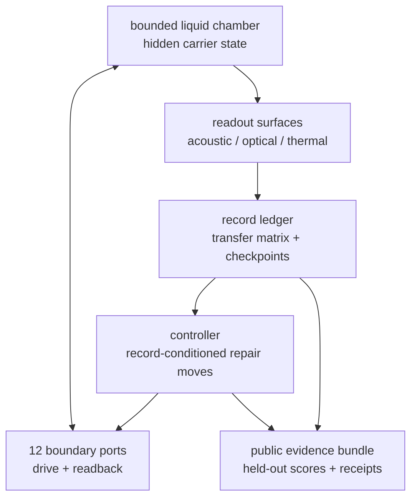

# Plasma Fusion and Confinement

## Motivating Result

This note entered the queue after the National Ignition Facility's December 5,
2022 ignition shot: 2.05 MJ of laser energy delivered to the target and 3.15 MJ
of fusion energy out
([NIF, "Achieving Fusion Ignition"](https://lasers.llnl.gov/science/achieving-fusion-ignition)).
That laboratory result made the old phrase "fusion solved" too blunt. The OPH
question is which receipt actually closed: fusion products at the target, heat
capture, delivered electrical load, or net plant output.

**Status:** proposed OPH repair-ledger and promotion contract; empirical fusion
and reactor claims unresolved. The conditional mathematical statements below
organize confinement and evidence checks. They do not establish a new
confinement regime, a superior controller, DD production, or net plant power.

Date: 2026-07-08
Audit revision: 2026-07-11

## Problem, Standard Physics, and OPH Contribution

**Standard physics.** Fusion science has quantitative models for reaction
cross sections, magnetohydrodynamic stability, kinetic turbulence, confinement
scalings, edge physics, neutral transport, wall loading, tritium breeding, and
plant engineering. Standard fusion programs also distinguish target or plasma
gain, engineering gain, net electric output, availability, and material
survivability. The difficulty is physical integration: a device can produce
fusion products without capturing useful heat; improve confinement while
worsening divertor or wall loads; or pass a target-level gain metric while the
facility remains energy-negative.

**Unresolved target.** The unresolved problem is to sustain a reactor-relevant
burn while simultaneously controlling core transport, pedestal stability, heat
exhaust, ash, impurities, wall damage, fuel supply, tritium breeding on DT
branches, recirculating power, and availability. No scalar Lawson value,
detector event, or bookkeeping convention solves that integrated optimization.

**OPH contribution.** OPH represents the device as a bounded self-reading
physical/software patch: local plasma and wall state, actuator and diagnostic
ports, boundary readback, durable records, feedback or repair moves, and public
evidence receipts. It places those objects in one typed ledger and prevents a
receipt at one claim tier from being silently reused at the next. This is a
formal control-and-evidence architecture, not a replacement for MHD,
gyrokinetics, nuclear cross sections, materials science, or plant engineering.
Model-predictive control, systems engineering, and staged gain accounting are
not unique to OPH; the OPH-specific proposal is their quotient-visible,
observer-like self-reading formulation.

The modeling labels used below are:

- **standard physics:** conservation laws, fusion source rates, confinement
  time, established stability variables, and measured plant/device boundaries;
- **OPH model definition:** quotient state, residual vector, proximal repair
  map, and receipt ladder;
- **conditional theorem:** a mathematical implication that holds only under its
  displayed regularity, feasibility, or contraction assumptions;
- **empirical evidence:** a public calibrated run, matched controller trial, DD
  detector likelihood, calorimetry, or plant ledger. No such evidence is
  supplied by this note.

## Abstract

This note models fusion confinement as a boundary-repair ledger. The ledger
keeps plasma state, actuators, diagnostics, wall state, hard constraints,
residuals, repair/control moves, and claim gates in one typed record. A
contracting edge map is an OPH candidate model for a stable H-mode basin; a
separate hybrid jump model is needed for ELMs. Lawson is a scalar energy
projection. DD products, heat, delivered power, and net plant power live in
separate receipt tiers.

## External Benchmarks and Plant Gate

Fusion products alone do not define a reactor. The receipt ladder is

```math
\text{fusion products}
\to
\text{fusion heat}
\to
\text{captured heat}
\to
\text{electricity}
\to
\text{net plant output}
\to
\text{useful availability}.
```

ITER's public design target is plasma gain $Q\ge10$: about
$500\,\mathrm{MW}$ fusion power from $50\,\mathrm{MW}$ of plasma heating
for $400$ to $600$ second pulses. That is a plasma gate. Electricity
generation and whole-plant gain occupy separate gates.

NIF's repeated ignition results are target-level inertial-confinement gates.
The [April 2025 LLNL result](https://annual.llnl.gov/fy-2025/national-ignition-facility-2025)
reports $2.08\,\mathrm{MJ}$ delivered to the target and
$8.6\pm0.45\,\mathrm{MJ}$ fusion yield, a target gain of $4.13$. The
whole-facility and grid-power ledgers remain separate from that target gate.

For a plant claim, fix a time interval and a physical boundary. Define

```math
\Delta E_{\rm stored}
=E_{\rm stored}(t_1)-E_{\rm stored}(t_0),
```

and let the nonoverlapping external-input ledger be

```math
E_{\rm ext,in}
=
E_{\rm drive}
+E_{\rm startup}
+E_{\rm shutdown}
+E_{\rm aux}
+E_{\rm consumables}
+E_{\rm maintenance}
+E_{\rm waste\ handling}.
```

Every term is an energy crossing the declared boundary and may appear exactly
once. The net exported-energy ledger is

```math
L_{\rm plant}
=
E_{\rm grid,out}
+\Delta E_{\rm stored}
-E_{\rm ext,in}.
```

With the stated sign convention, drawing down stored energy reduces rather than
inflates $L_{\rm plant}$. If stored energy is not a qualified useful output,
report it separately and use the stricter grid-only ledger after excluding any
storage drawdown.

The net-plant promotion condition is

```math
L_{\rm plant}>5u_L,
```

where $u_L$ is the propagated uncertainty for the same boundary and interval.
The factor five is a declared engineering evidence margin, not automatically a
five-sigma probability statement without a distributional error model.

The OPH contribution in this problem is a confinement and accounting layer:
magnetic-confinement boundary repair, edge control, loss-channel closure, and
plant-gate bookkeeping.

## Definition 1: OPH Fusion Repair Ledger

Fix a regulator $r$. An OPH Fusion Repair Ledger is the tuple

```math
\mathfrak L^{\rm fus}_r
=
\left(
Q_r,
\mathcal V_r,\mathcal E_r,
\{S_{i,r}\},
\{I_{e,r},\pi_{i,e,r}\},
\mathcal R^{\rm hot}_r,
\mathcal P_r,
\mathcal H_r,
\mathcal U_r,
\Phi^{\rm fus}_r,
T^{\rm BR}_r,
\mathsf{Gate}_r
\right).
```

The physical quotient state space is

```math
Q_r=\Sigma_r/\Gamma_r.
```

$\Sigma_r$ is the presentation space of plasma, actuator, diagnostic, wall,
control, and evidence records. Two presentations are equivalent under
$\Gamma_r$ only when relabeling leaves all declared observables, transition
probabilities, admissible controls, constraints, and evidence validators
unchanged. Gauge, mesh, diagnostic-channel, port, worker, and scheduler labels
may be removed under that test. A nominally hidden carrier coordinate may not
be quotiented away if it changes a future visible readout or control response.

For a tokamak branch,

```math
V_{\rm tok}
=
\{C,P,E,SOL,D,W,M,H,F,X,G\},
```

where $C$ is core, $P$ pedestal, $E$ edge collar, $SOL$ scrape-off
layer, $D$ divertor, $W$ wall, $M$ magnetic system, $H$ heating/current
drive, $F$ fueling/pumping, $X$ diagnostics, and $G$ controller.

For a twelve-port acoustic carrier branch,

```math
V_H=
\{\mathrm{chamber},\mathrm{fluid},P_1,\ldots,P_{12},
\mathrm{controller},\mathrm{optical},\mathrm{acoustic},
\mathrm{thermal},\mathrm{radiation},\mathrm{load}\}.
```

Each $S_{i,r}$ is a local patch state. For a magnetized plasma,

```math
s_i=
(n_e,n_i,T_e,T_i,p,j,q,\mathbf B,E_r,\mathbf v,
Z_{\rm eff},n_0,n_{\rm ash},f_\alpha,\mathcal T_{\rm turb},\ldots)_i.
```

For an acoustic carrier,

```math
s_i=
(H_{ij},x_{\rm readback},z_{\rm collapse},T_{\rm fluid},
p_{\rm acoustic},R_{\rm records},A_{\rm artifact},u_{\rm drive},\ldots)_i.
```

The interface maps

```math
\pi_{i,e}:S_i\to I_e
```

expose boundary-visible data: heat flux, particle flux, current flux, radiation,
neutral flux, turbulence spectrum, pedestal gradient, acoustic transfer matrix,
optical flash timing, detector counts, calorimeter output, load output, and
receipt state.

The hot record is

```math
\mathcal R^{\rm hot}_r
=
(W,\bar n,\bar T_i,\bar T_e,Y_{\rm fus},\tau_E,
\Pi_{\rm stab},\Pi_{\rm exhaust},\Pi_{\rm wall}).
```

The physical source/loss ledger is

```math
\mathcal P_r(q)
=
(P_{\rm aux},P_{\rm ch},P_{\rm loss},W,\tau_E,Y_{\rm fus}).
```

The hard constraints are

```math
\mathcal H_r=
\{
q_{\rm div}\le q_{\rm div}^{\max},
\ s_{\rm PB}<1,
\ Z_{\rm eff}\le Z_{\rm eff}^{\max},
\ f_{\rm ash}\le f_{\rm ash}^{\max},
\ D_{\rm mat}\le D_{\rm mat}^{\max}
\}.
```

These are physical feasibility constraints. Evidence-tier closure is evaluated
by $\mathsf{Gate}_r$ after a run; it is not an actuator-selectable physical
constraint and is not inserted into the control objective.

$\mathcal U_r$ is the declared repair/control menu: heating, current drive,
shaping, fueling, pumping, impurity seeding, divertor control, resonant magnetic
perturbations, pellet pacing, feedback control, acoustic multi-port drive,
checkpoint restore, or another declared control move.

The scalar mismatch functional is $\Phi^{\rm fus}_r$. The boundary-repair
operator is $T^{\rm BR}_r$. The claim gate $\mathsf{Gate}_r$ records the
claim tier: mathematical, carrier, control, DD product, DD heat, delivered
power, or net plant.

## Fusion Mismatch Functional

Define

```math
\Phi^{\rm fus}_r(q)
=
\|\mathbf r(q)\|_{\mathsf W_r}^2
+\iota_{\mathcal H_r}(q).
```

$\mathbf r(q)$ is a vector of dimensionless residuals.
$\mathsf W_r\succ0$ is a weight matrix fixed before comparison and is distinct
from stored energy $W$. $\iota_{\mathcal H_r}$ is zero when
hard physical constraints pass and $+\infty$ otherwise.
The separately evaluated $\mathsf{Gate}_r$ is zero/pass only when the evidence
receipts for the claimed tier are present. Keeping it outside
$\Phi^{\rm fus}_r$ prevents a missing post-run receipt from making every state
in a control minimization have infinite cost.

A concrete residual vector is

```math
\mathbf r=
(
r_{\rm bal},
r_W,
r_\tau,
r_Y,
r_\chi,
r_{\nabla p},
r_{\rm shear},
r_{\rm PB},
r_{\rm KBM},
r_j,
r_q,
r_{\rm ash},
r_Z,
r_{\rm rad},
r_{\rm wall},
r_{\rm unclass}
).
```

The instantaneous conservation residual is

```math
r_{\rm bal}
=
\frac{\dot W-P_{\rm aux}-P_{\rm ch}+P_{\rm loss}}{P_0},
\qquad P_0>0.
```

This tests the energy identity rather than penalizing only one sign. A separate
one-sided survival margin may be used in a declared steady-state controller,
$[P_{\rm loss}-P_{\rm aux}-P_{\rm ch}]_+/P_0$.

The record residuals are

```math
r_W=
\left[
\frac{W_{\rm req}-W}{W_{\rm req}}
\right]_+,
\qquad
r_\tau=
\left[
\frac{\tau_{\rm req}-\tau_E}{\tau_{\rm req}}
\right]_+,
```

```math
r_Y=
\left[
\frac{Y_{\rm req}-Y_{\rm fus}}{Y_{\rm req}}
\right]_+.
```

The edge residuals are

```math
r_\chi=
\left[
\frac{\chi_{\rm edge}-\chi_{H,\max}}{\chi_L}
\right]_+,
```

```math
r_{\nabla p}
=
\frac{
\left\|\nabla p_{\rm edge}-\nabla p_{\rm target}\right\|_{G_E}
}{g_{p,0}},
\qquad g_{p,0}>0,
```

where $g_{p,0}$ is a frozen scalar gradient scale. This avoids undefined
division by a vector or by a vanishing target component.

```math
r_{\rm shear}
=
\left[
\frac{\gamma_{\rm turb}-\gamma_{E\times B}}{\gamma_0}
\right]_+.
```

Pedestal and exhaust residuals include

```math
r_{\rm PB}
=
\left[
\frac{\alpha_{\rm PB}}{\alpha_{\rm PB,crit}}-1
\right]_+,
\qquad
r_{\rm KBM}
=
\left[
\frac{\alpha_{\rm KBM}}{\alpha_{\rm KBM,crit}}-1
\right]_+,
```

```math
r_j=
\left[
\frac{|j_{\rm ped}|}{j_{\rm crit}}-1
\right]_+,
\qquad
r_q=
\left[
\frac{q_{\rm div}-q_{\rm div}^{\max}}{q_{\rm div}^{\max}}
\right]_+.
```

The remaining declared residuals may be instantiated as

```math
r_{\rm ash}
=\left[\frac{f_{\rm ash}}{f_{\rm ash}^{\max}}-1\right]_+,
\qquad
r_Z
=\left[\frac{Z_{\rm eff}}{Z_{\rm eff}^{\max}}-1\right]_+,
```

```math
r_{\rm rad}
=\left[\frac{P_{\rm rad}-P_{\rm rad}^{\max}}{P_0}\right]_+,
\qquad
r_{\rm wall}
=\left[\frac{D_{\rm mat}}{D_{\rm mat}^{\max}}-1\right]_+.
```

All denominators and thresholds must be positive and frozen before a controller
comparison. A different branch may replace these formulas, but it must not list
an undefined residual in the score.

The unclassified-loss residual is

```math
r_{\rm unclass}
=
\frac{|R_{\rm audit}|}{u_R},
```

where

```math
R_{\rm audit}
=
\Delta W
-
\int_{t_0}^{t_1}(P_{\rm aux}+P_{\rm ch})\,dt
+
\sum_{\ell\in L}
\int_{t_0}^{t_1}P_\ell\,dt.
```

Here $\Delta W=W(t_1)-W(t_0)$, every $P_\ell$ is positive outward, and
$P_{\rm loss}=\sum_\ell P_\ell$. This residual forces every claimed loss
channel into the ledger. Signed-flux conventions require the corresponding
explicit sign change.

## Boundary-Repair Operator

Let $F_{\Delta t}$ be ordinary substrate evolution over one repair interval:
MHD/gyrokinetic transport for a plasma branch, or acoustic/fluid evolution for
an acoustic carrier branch. OPH wraps that evolution in a quotient-visible
repair/readout operator:

```math
T^{\rm BR}_{\Delta t,u}(q)
=
\mathrm{arg\,min}_{q'\in Q_r}
\left\{
\Phi^{\rm fus}_r(q')
+
\frac{1}{2\eta_{\rm BR}}
d_{G,r}\!\left(q',F_{\Delta t}(q,u)\right)^2
\right\}.
```

$d_{G,r}$ is a metric on the quotient, so subtraction of two quotient states
is not assumed. The state coordinates, metric, and $\eta_{\rm BR}>0$ must be
scaled so the two objective terms have compatible units. Existence requires a
nonempty feasible set and the usual compactness/coercivity and lower
semicontinuity assumptions; uniqueness requires additional convexity. The
substrate evolution must also descend to $Q_r$, meaning equivalent
presentations give equivalent evolved states.

For the edge subsystem $z_E$, define the free edge evolution field

```math
f_E(z_E;q_C,q_X,u)
```

and edge ledger $\Phi_E(z_E;q_C,q_X)$. The local edge map is

```math
T_E(z_E)
=
\mathrm{prox}^{G_E}_{\eta\Phi_E}
\left(
z_E+\eta f_E(z_E;q_C,q_X,u)
\right),
```

with

```math
\mathrm{prox}^{G_E}_{\eta\Phi_E}(y)
=
\mathrm{arg\,min}_{z}
\left\{
\Phi_E(z)
+
\frac{1}{2\eta}\|z-y\|_{G_E}^2
\right\}.
```

For this coordinate expression, $z$ is a nondimensional edge chart (or the
metric carries the required units), $\eta>0$, and the feasible edge basin is
declared explicitly.

## OPH Confinement Engine

The reactor-relevant OPH architecture is

```math
\text{high-field tokamak or stellarator}
+
\text{real-time boundary ledger}
+
\text{repair controller}
+
\text{strict net-plant gate}.
```

At each control time, the inferred plasma state is

```math
q_t=
(n,T_i,T_e,p,j,q,E_r,\mathbf B,\mathbf v,
Z_{\rm eff},n_0,n_{\rm ash},\mathcal T_{\rm turb},q_{\rm div},\ldots).
```

The controller computes

```math
\Phi_{\rm fus}(q_t),
\qquad
\kappa_E^{\rm loc}(z_E(q_t)),
\qquad
s_{\rm PB}(q_t),
\qquad
R_{\rm audit}(q_t).
```

The declared actuator vector is

```math
u_t=
(P_{\rm aux},
\text{current drive},
\text{fueling},
\text{pellets},
\text{RMPs},
\text{impurity seeding},
\text{divertor control},
\text{shape control}).
```

The OPH controller solves the constrained repair problem

```math
u_t^\star
=
\mathrm{arg\,min}_{u}
\mathbb E
\left[
\Phi_{\rm fus}(q_{t+\Delta t})
+
\lambda_{\rm aux}E_{\rm aux}
+
\lambda_{\rm wall}D_{\rm mat}
\mid q_t,u
\right]
```

The expectation is with respect to a declared state-estimation and transition
model. $\lambda_{\rm aux}$ and $\lambda_{\rm wall}$ carry whatever units are
needed to make the objective dimensionless, and their values are preregistered.
Evidence receipts are not decision variables in this optimization.

subject to

```math
\kappa_E^{\rm loc}(z_E(q_{t+\Delta t}))<1,
\qquad
s_{\rm PB}<1,
\qquad
q_{\rm div}<q_{\rm div}^{\max},
```

```math
Z_{\rm eff}<Z_{\rm eff}^{\max},
\qquad
f_{\rm ash}<f_{\rm ash}^{\max},
\qquad
TBR>1+\delta_{\rm TBR}
```

on DT plant branches, plus

```math
L_{\rm plant}>0
```

for plant-facing operation. The promoted plant claim uses
$L_{\rm plant}>5u_L$ over a declared accounting horizon; it is not an
instantaneous state constraint unless a causal rolling-horizon estimator is
specified.

## Conditional Result 1: Quotient Well-Definedness

**Statement.** Assume the substrate evolution, observation maps, admissible
controls, residuals, hard constraints, and evidence validators are invariant or
equivariant under $\Gamma_r$. Then $\mathfrak L^{\rm fus}_r$ descends to a
quotient-visible ledger. Presentation states in one orbit have the same ledger
residuals, hard-constraint status, gates, and physical readouts.

**Proof.** Invariance makes each scalar and Boolean constant on
$\Gamma_r$-orbits, while equivariance makes the evolved orbit independent of
the chosen representative. Each object therefore induces a well-defined
function or transition on $Q_r$. This is an obligation to check for the
declared implementation, not a consequence of merely writing $Q_r$.
$\square$

## Standard Energy Result 2: Hot-Record Survival

**Statement.** Let $W$ be absolutely continuous and the powers integrable,
with the hot-record energy evolving under

```math
\frac{dW}{dt}=P_{\rm ch}+P_{\rm aux}-P_{\rm loss}.
```

The record survives on $[t_0,t_1]$ above threshold $W_{\rm req}$ exactly
when

```math
W(t_0)+\int_{t_0}^{t}
(P_{\rm ch}+P_{\rm aux}-P_{\rm loss})\,ds
\ge W_{\rm req}
```

for every $t\in[t_0,t_1]$.

**Proof.** Integrating the energy equation gives the displayed expression for
$W(t)$. The record-survival condition is $W(t)\ge W_{\rm req}$. Substitution
gives the inequality. $\square$

## Conditional Result 3: Lawson Criterion as Scalar Projection

**Statement.** In a steady scalar projection with stored energy $W$ and
confinement time

```math
\tau_E=\frac{W}{P_{\rm loss}},
```

the energy-record survival condition becomes

```math
P_{\rm ch}+P_{\rm aux}\ge \frac{W}{\tau_E}.
```

On an equimolar quasineutral DT branch with $T_e=T_i=T$, $T$ expressed in
energy units, and $n=n_e=n_i$, one has $W\simeq3nTV$. For ignition set
$P_{\rm aux}=0$ and use

```math
P_\alpha
=
\frac{n^2}{4}\langle\sigma v\rangle_{DT}(T)E_\alpha V.
```

The balance then gives the temperature-dependent triple-product requirement

```math
nT\tau_E
\ge
\frac{12T^2}{\langle\sigma v\rangle_{DT}(T)E_\alpha},
```

If $P_{\rm loss}$ and $\tau_E$ exclude a separately modeled radiative term,
that term must be added to the balance. Other density conventions, fuel
mixtures, $T_e\ne T_i$, or nonzero auxiliary gain change the factors.

**Proof.** Nondecreasing stored energy requires $dW/dt\ge0$, so
$P_{\rm ch}+P_{\rm aux}\ge P_{\rm loss}$. Since
$P_{\rm loss}=W/\tau_E$, the first inequality follows. The stated DT
assumptions and $P_{\rm ch}=P_\alpha$ give the displayed triple-product
formula by substitution. Strict steady state uses equality. $\square$

## Conditional Result 4: Finite Normal Form of Fusion Repair

**Statement.** Suppose $Q_r$ is finite, accepted repair steps strictly
decrease a discrete measure $\mu$, atomic conflict-component commits satisfy
local confluence, and repair completeness identifies terminal states with the
declared confinement normal forms or obstruction states. Then the terminal
fusion state

```math
\mathrm{nf}_{\mathfrak L}(q_0)
```

is unique and schedule-independent.

**Proof.** Since $Q_r$ is finite and $\mu$ strictly decreases, no infinite
accepted repair sequence exists. Termination plus local confluence gives
confluence by Newman's lemma. Repair completeness identifies terminal states
with the declared normal forms or obstruction states. The terminal quotient
state is unique and schedule-independent. $\square$

This result concerns a finite rewrite/controller abstraction. Connecting its
normal form to a physical plasma requires a discretization map, validated
substrate dynamics, and refinement evidence; confluence alone does not imply
confinement.

## Conditional Result 5: Noisy Repair Tube

**Statement.** Let $\mathcal N\subset Q_r$ be the exact normal-form set.
Suppose noisy fair blocks satisfy

```math
\mathbb E[D(q_{k+1})\mid q_k]\le \lambda D(q_k)+\varepsilon,
\qquad
0<\lambda<1,
```

where $D(q)=\mathrm{dist}(q,\mathcal N)$, and within-block excursions
are bounded by $A D(q)+\beta$. Then

```math
\limsup_{k\to\infty}\mathbb E D(q_k)
\le
\frac{\varepsilon}{1-\lambda},
```

with within-block tube radius controlled by $A\varepsilon/(1-\lambda)+\beta$.

**Proof.** Iterating the affine inequality gives

```math
\mathbb E D(q_k)
\le
\lambda^k D(q_0)
+
\varepsilon\sum_{j=0}^{k-1}\lambda^j.
```

Taking $k\to\infty$ gives the bound. The within-block bound follows from the
stated excursion estimate. This is the noisy fair-block consensus theorem
specialized to the fusion ledger. $\square$

Here $\varepsilon$ and $\beta$ have the same distance units as $D$, and
the within-block estimate is understood pathwise or in expectation according
to the declared excursion assumption. This is a stability bound for the model,
not a measured confinement scaling.

## H-Mode Edge Gate

H-mode is a useful OPH modeling target because standard fusion physics
identifies it as an edge transport-barrier regime. The barrier builds an edge
pedestal and often raises energy confinement time relative to L-mode, while the
pedestal can approach peeling-ballooning and related stability limits. The OPH
candidate identification is

```math
\text{contracting OPH edge model}
=
\text{edge-collar repair fixed point}.
```

This is a model correspondence to test, not a derivation or definition of all
physical H-mode plasmas.

Define the local Jacobian norm and the basin contraction diagnostic by

```math
\kappa_E^{\rm loc}(z)=\|DT_E(z)\|_{G_E},
\qquad
\kappa_E^{\rm basin}
=
\sup_{z\in\mathcal B_E}
\kappa_E^{\rm loc}(z)<1,
```

for a declared invariant edge basin $\mathcal B_E$. A local value below one
at one state is not a Banach contraction certificate for the basin.

The corresponding model threshold diagnostic is

```math
P_{LH}^{\rm OPH}
=
\inf\{P_{\rm aux}:\kappa_E^{\rm basin}<1
\text{ and all declared hard constraints pass}\}.
```

The infimum is evaluated for a frozen operating packet containing density,
field, geometry, species, actuator menu, initial condition, and hysteresis
branch. It becomes a physical L-H threshold predictor only after held-out
validation against an empirical threshold baseline and hysteresis-aware data.

## Conditional Result 6: Proximal Edge Contraction

Let the edge map be

```math
T_E=\mathrm{prox}^{G_E}_{\eta(\Phi_E+\iota_{\mathcal B_E})}
\circ (I+\eta f_E).
```

Assume the edge chart is a Hilbert space with one fixed metric \(G_E\) and
\(\mathcal B_E\) is a nonempty closed convex subset. Assume
\(\Phi_E+\iota_{\mathcal B_E}\) is proper, lower semicontinuous, and
\(m_E\)-strongly convex, while \(f_E\) is \(L_E\)-Lipschitz on
\(\mathcal B_E\). The restricted proximal map returns a point in the basin,
so \(T_E:\mathcal B_E\to\mathcal B_E\). If

```math
m_E>L_E,
```

then $T_E$ is a contraction with coefficient

```math
\kappa_E^{\rm basin}\le \frac{1+\eta L_E}{1+\eta m_E}<1.
```

Hence the model edge fixed point exists and is unique in the basin. Calling it
an H-mode representation additionally requires the held-out physical
correspondence tests above.

**Proof.** On the fixed Hilbert metric, the proximal map of the proper,
lower-semicontinuous, \(m_E\)-strongly convex function
\(\Phi_E+\iota_{\mathcal B_E}\) is
$(1+\eta m_E)^{-1}$ Lipschitz. The free edge step $I+\eta f_E$ is
$(1+\eta L_E)$ Lipschitz on the declared basin. The composition has Lipschitz
constant at most $(1+\eta L_E)/(1+\eta m_E)$. If $m_E>L_E$, the constant is
less than one. Banach's fixed-point theorem gives a unique fixed point and
geometric convergence. $\square$

## Standard Identity 7: Lower Loss Raises $\tau_E$ at Fixed $W$

**Statement.** Let $q_H$ be a candidate edge fixed point from Result 6. If the
edge-loss component satisfies

```math
P_{\rm loss}(q_H)<P_{\rm loss}(q_L)
```

at fixed stored energy $W$, then

```math
\tau_E(q_H)>\tau_E(q_L).
```

**Proof.** Since $\tau_E=W/P_{\rm loss}$, fixed $W$ turns a lower loss into
a higher confinement time. This identity does not predict that a proposed
controller will achieve the premise. $\square$

## Conditional Model 8: ELM-Like Hybrid Jump Cycles

Keep pedestal stability separate from divertor exhaust. Define the candidate
pedestal margin

```math
s_{\rm PB}
=
\max
\left(
\frac{\alpha_{\rm PB}}{\alpha_{\rm PB,crit}},
\frac{\alpha_{\rm KBM}}{\alpha_{\rm KBM,crit}},
\frac{|j_{\rm ped}|}{j_{\rm crit}}
\right),
```

while $q_{\rm div}/q_{\rm div}^{\max}$ remains a separate exhaust gate. Let
$\varphi_t$ denote the between-event edge flow, let
$\tau(z)=\inf\{t>0:s_{\rm PB}(\varphi_t(z))\ge1\}$, and let
$J_{\rm ELM}$ be a declared physical jump model. A natural ELM instability
and an actuator-triggered paced event may use different jump maps.

**Statement.** If the threshold is reached transversely, $J_{\rm ELM}$
returns states to a declared edge basin, and the Poincaré return map

```math
\mathcal P(z)
=
\varphi_{\tau(J_{\rm ELM}(z))}
\!\left(J_{\rm ELM}(z)\right)
```

has an attracting fixed point $z_\star$, then the hybrid model has an
attracting obstruction/jump cycle through $z_\star$.

**Proof.** A fixed point of the event-to-event return map reproduces the same
post-flow threshold state after one jump and rebuild interval. Attraction of
that fixed point gives stability of the modeled cycle. $\square$

This conditional hybrid result does not show that all physical ELMs have one
mechanism or that an OPH controller suppresses them. Those are empirical claims
requiring pedestal diagnostics, event timing, energy-loss distributions, and
matched conventional control.

## Standard Energy Result 9: Loss-Channel Audit Closure

**Statement.** Over a declared interval $[t_0,t_1]$, the energy ledger closes
at uncertainty $u_R$ when

```math
\left|
\Delta W
-
\int_{t_0}^{t_1}(P_{\rm aux}+P_{\rm ch})\,dt
+
\sum_{\ell\in L}\int_{t_0}^{t_1}P_\ell\,dt
\right|
\le u_R.
```

**Proof.** With every $P_\ell$ positive outward, conservation gives
$\Delta W=\int(P_{\rm aux}+P_{\rm ch})dt-\sum_\ell\int P_\ell dt$.
Rearrangement yields the displayed residual. A value outside the propagated
uncertainty indicates an omitted term, a sign/boundary mismatch, or an erroneous
estimate. $\square$

## Reactor-Relevance Score

OPH earns reactor relevance by beating matched conventional control on declared
plasma and plant gates. Let $C$ be the accepted set of baseline controllers
for the same device, wall condition, field, density, heating menu, and
diagnostic access. Select a comparator $c_\star$ before opening the held-out
evaluation set, or use a preregistered multiplicity-corrected comparison over
$C$. Define

```math
\Delta M_{\rm OPH}
=
M_{\rm OPH}-M_{c_\star},
\qquad
G_{\rm OPH}=e^{\Delta M_{\rm OPH}}>0.
```

A preregistered dimensionless plasma utility can be written as

```math
M
=
w_1\log\!\left(\frac{\tau_E}{\tau_{E,0}}\right)
+
w_2\log\!\left(1+\frac{P_{\rm fus}}{P_{{\rm fus},0}}\right)
-
w_3\frac{q_{\rm div}}{q_{\rm div}^{\max}}
-
w_4s_{\rm PB}
-
w_5\frac{Z_{\rm eff}}{Z_{\rm eff}^{\max}}
-
w_6\frac{f_{\rm ash}}{f_{\rm ash}^{\max}}
-
w_7\frac{D_{\rm mat}}{D_{\rm mat}^{\max}}.
```

All reference scales are positive and frozen, and the weights and aggregation
rule are fixed before comparison. This avoids division by a vanishing
$P_{\rm aux}$, negative score ratios, and post hoc selection of a favorable
baseline. Fusion gain $Q=P_{\rm fus}/P_{\rm aux}$ remains a separately
reported physical metric on runs where $P_{\rm aux}>0$.

The comparison passes at effect size $\delta$ only when

```math
\mathrm{LCB}_{95}(\Delta M_{\rm OPH})
>
\log(1+\delta).
```

The confidence-bound construction must name its discharge-level sampling unit,
pairing, uncertainty model, and correction for repeated controllers or
outcomes.

Useful OPH wins include

```math
P_{LH}^{\rm OPH}<P_{LH}^{\rm best},
```

```math
\tau_E^{\rm OPH}
>
(1+\delta_\tau)\tau_E^{\rm best},
```

```math
f_{\rm ELM}^{\rm OPH}<f_{\rm ELM}^{\rm best},
\qquad
\Delta W_{\rm ELM}^{\rm OPH}<\Delta W_{\rm ELM}^{\rm best},
```

and

```math
q_{\rm div}^{\rm OPH}<q_{\rm div}^{\max}
```

without radiative collapse.

## Validation Path

Validation uses five gates:

1. Offline scorebook: freeze
   ```math
   \mathfrak L^{\rm fus}
   =(Q_r,\Phi_{\rm fus},T_E,\kappa_E^{\rm loc},
   \kappa_E^{\rm basin},P_{LH}^{\rm OPH},R_{\rm audit})
   ```
   and test whether $\kappa_E^{\rm basin}<1$ predicts L-H transition better than a
   declared empirical threshold baseline.
2. Digital twin: run the OPH controller in a validated simulator and reduce
   $\Phi_{\rm fus}$ against conventional controllers using only data
   available at decision time.
3. Non-burning plasma test: attach the controller to an authorized tokamak or
   stellarator campaign and test lower $P_{LH}$, improved pedestal control,
   lower ELM burden, and controlled divertor heat flux.
4. Integrated high-performance plasma: satisfy
   ```math
   \kappa_E^{\rm basin}<1,
   \qquad
   s_{\rm PB}<1,
   \qquad
   q_{\rm div}<q_{\rm div}^{\max},
   \qquad
   Z_{\rm eff}<Z_{\rm eff}^{\max}
   ```
   in the same campaign.
5. Burning-plasma integration: promote only after
   ```math
   P_\alpha+P_{\rm aux}\ge P_{\rm loss}
   ```
   with the ignition subcase
   ```math
   P_\alpha\ge P_{\rm loss}
   ```
   and the plant condition $L_{\rm plant}>5u_L$.

A candidate engineering hypothesis is compact high-field magnetic confinement
with aggressive boundary control: strong shaping, high-bandwidth edge
diagnostics, real-time profile inference, divertor and impurity control, ELM
suppression or pacing, alpha-heating-aware control, and whole-plant ledger
closure. This preference is not derived by the ledger and must be compared with
stellarator and other declared reactor baselines.

## Hydrosahedron Carrier Specialization

Hydrosahedron belongs to the carrier/control tier. It tests whether a
twelve-port self-reading acoustic boundary outperforms matched non-OPH acoustic
controls. DD and power claims require the promotion gates below.

Hydrosahedron is the internal name for a small receipt-gated OPH acoustic test
cell. In public OPH language, it is a bounded liquid carrier whose boundary has
twelve addressable ports. Each port is part actuator and part readback surface:
the controller drives a declared acoustic pattern, reads the boundary response,
records the transfer result, and chooses the next repair/control move from that
record. The object under test is not a hidden internal fluid state by itself; it
is the self-reading boundary ledger that links drive, readback, checkpoint, and
public receipt.

The public architecture is deliberately schematic:



This diagram is not a build schematic. It omits dimensions, materials, wiring,
drive waveforms, calibration tables, safety procedures, and operating recipes.
Those detailed mechanical and electrical schematics, CAD files, component
selections, calibration artifacts, and procedures are private engineering
material in the private `oph-fusion` repository. Public claims from that branch
must be exported as redacted receipt bundles or benchmark reports; possession of
private schematics is not itself a public OPH claim.

A twelve-port acoustic carrier has source branch

```math
\mathfrak H_r
=
\left(
Q_H,
H_{P_\star},
\eta_{\rm ac},
R_{\rm records},
\mathsf{Gate}_{H}
\right).
```

$H_{P_\star}$ is a frozen OPH-template transfer matrix. Its source, parameter
count, and predictive distribution must be declared. For a comparator $c_\star$
selected before held-out evaluation, use the paired score

```math
S(P_\star)
=
\log p(H_{\rm test}\mid H_{P_\star})
-
\log p(H_{\rm test}\mid H_{c_\star}),
```

with pass condition

```math
\mathrm{LCB}_{1-\alpha}(S(P_\star))>\delta_P.
```

If several controls are compared, the selection and confidence procedure must
correct for multiplicity and shared test data.

## Classification Result 10: Hydrosahedron Carrier Status

**Statement.** If the twelve-port carrier exposes bounded ports, durable
records, self-readout, record-conditioned control, held-out boundary prediction
against matched controls, and checkpoint continuation, then it is an OPH
carrier-patch/control specialization. That result promotes no DD or power
claim.

**Proof.** The listed receipts instantiate the OPH observer-patch tuple:
bounded interface, local state, records, readback, repair instruments, and
checkpoint continuation. Passing those receipts promotes the carrier-patch and
acoustic-control claim. The DD and power predicates use different source,
detector, calorimetry, load, and plant ledgers, so they do not follow.
$\square$

## DD and Power Promotion Gates

Under a local Maxwellian assumption, the total DD reaction yield is

```math
Y_{DD}
=
\int
\frac12 n_D^2
\langle\sigma v\rangle_{DD}(T)
\,dV\,dt.
```

For a nonequilibrium acoustic carrier, the Maxwellian assumption must be tested
or replaced by the velocity-distribution integral. The neutron yield is

```math
Y_n
=
\int b_n(T)\,
\frac12 n_D^2\langle\sigma v\rangle_{DD}(T)\,dV\,dt,
```

where $b_n$ is the neutron-branch fraction unless the tabulated reactivity is
already branch-specific.

The DD source gate requires source and detector receipts:

```math
C_d\sim\operatorname{Poisson}(\lambda_d),
\qquad
\lambda_d
=B_d+\epsilon_d f_{\Omega,d}T_dY_n+A_d.
```

Here $B_d$ is the time-matched expected background, $\epsilon_d$ is calibrated
efficiency, $f_{\Omega,d}=\Omega_d/(4\pi)$ is geometric acceptance, $T_d$
collects attenuation and live-time response, and $A_d$ is a preregistered
artifact contribution with nuisance uncertainty. Real promotion also requires
dead-time treatment, pulse-shape or time-of-flight checks where applicable,
controls, and a multi-detector likelihood; an isolated count excess is not a DD
certificate.

The captured-heat gate requires calibrated calorimetry. Delivered-power
requires an isolated load and a source-attribution test. Net plant energy uses
the same nonoverlapping boundary convention defined above:

```math
L=E_{\rm load,out}+\Delta E_{\rm stored}-E_{\rm ext,in}.
```

The promotion condition is

```math
L>5u_L,
```

or another declared statistical margin.

## Logical Result 11: Non-Promotion

**Statement.** The following implications are invalid without the next receipt:

```math
\text{self-reading carrier}
\nRightarrow
\text{DD fusion},
```

```math
\text{DD products}
\nRightarrow
\text{captured heat},
```

```math
\text{captured heat}
\nRightarrow
\text{delivered load power},
```

```math
\text{delivered load power}
\nRightarrow
\text{net plant power}.
```

**Proof.** Each implication has a countermodel. A twelve-port acoustic system
can pass self-reading control tests without deuterium. A $P_\star$ template
can predict an acoustic matrix without nuclear products. Collapse control can
improve focusing while staying below DD-relevant temperature-density-time. DD
products can occur at trace yield while the run remains energy-negative. DD heat
can be real but uncaptured. Delivered electrical power can come from
stored/startup/auxiliary energy unless the full plant ledger closes. No tier
promotes to the next tier without the next receipt. $\square$

## Ledger Summary and Promotion Contract

Given an OPH Fusion Repair Ledger $\mathfrak L^{\rm fus}_r$ with a validated
quotient state space $Q_r$, mismatch $\Phi^{\rm fus}_r$, substrate evolution,
boundary-repair operator $T^{\rm BR}_r$, edge map $T_E$, physical constraints
$\mathcal H_r$, and separate claim gates $\mathsf{Gate}_r$, the proposal makes
the following conditional identifications:

1. A finite regulator may represent a confinement regime by a quotient normal
   form
   ```math
   \mathrm{nf}_{\mathfrak L}(q_0).
   ```
   This requires termination/confluence and a validated map back to plasma
   observables.
2. A contracting admissible edge normal form is an H-mode candidate model
   ```math
   \mathcal N_E
   =\{q\in\mathcal B_E:T_E(q)=q,\;
   \Phi_{\rm stab}(q),\Phi_{\rm exhaust}(q)\le\epsilon\},
   \qquad \kappa_E^{\rm basin}<1.
   ```
   The H-mode label requires held-out comparison with physical transition data.
3. The model L-H diagnostic is
   ```math
   P_{LH}^{\rm OPH}
   =
   \inf\{P_{\rm aux}:\kappa_E^{\rm basin}<1
   \text{ under hard constraints}\}.
   ```
   It is not a first-principles threshold prediction until the other operating
   variables and hysteresis branch are fixed and validation passes.
4. ELM-like obstruction/jump cycles are represented by the hybrid return map
   of Conditional Model 8; physical ELM identity and control benefit remain
   empirical.
5. The Lawson balance is the scalar energy-record projection
   ```math
   P_{\rm ch}+P_{\rm aux}\ge W/\tau_E.
   ```
6. A twelve-port acoustic carrier is a carrier-patch/control specialization,
   with DD and power claims separated by receipt tier.
7. A reactor-enabling OPH controller must beat matched conventional controllers
   by the declared lower-confidence-bound score:
   ```math
   \mathrm{LCB}_{95}(\Delta M_{\rm OPH})
   >
   \log(1+\delta).
   ```
8. Net plant promotion uses
   ```math
   L_{\rm plant}>5u_L.
   ```

Items 1--5 are conditional mathematics or standard energy identities; items
6--8 are classification and evidence rules. Together they define what an OPH
fusion claim would have to report. They do not close the physical confinement
or reactor problem without the corresponding public evidence.

## Scope

This note proposes a normal-form and repair-ledger model for fusion confinement.
The scalar Lawson row is one projection of a larger boundary ledger. H-mode
correspondence, ELM dynamics, acoustic-carrier control, DD products, heat,
delivered load power, and net plant power occupy different model and evidence
tiers. A failure of one empirical branch does not become a success by relabeling
it as another tier.

## References

- ITER, "Facts and Figures." https://www.iter.org/facts-figures
- ITER, "In a Few Lines." https://www.iter.org/few-lines
- International Atomic Energy Agency, "Fusion: Frequently asked questions."
  https://www.iaea.org/topics/energy/fusion/faqs
- National Ignition Facility and Photon Science, "Achieving Fusion Ignition."
  https://lasers.llnl.gov/science/achieving-fusion-ignition
- Lawrence Livermore National Laboratory, "National Ignition Facility - 2025."
  https://annual.llnl.gov/fy-2025/national-ignition-facility-2025
- J. D. Lawson, "Some Criteria for a Power Producing Thermonuclear Reactor,"
  *Proceedings of the Physical Society B* **70** (1957), 6--10.
  https://doi.org/10.1088/0370-1301/70/1/303
- F. Wagner et al., "Regime of Improved Confinement and High Beta in
  Neutral-Beam-Heated Divertor Discharges of the ASDEX Tokamak,"
  *Physical Review Letters* **49** (1982), 1408--1412.
  https://doi.org/10.1103/PhysRevLett.49.1408
- P. T. Lang et al., "Overview of Edge Localized Modes Control in Tokamak
  Plasmas", EUROfusion, 2010.
  https://scipub.euro-fusion.org/wp-content/uploads/2014/11/EFDP10019.pdf
